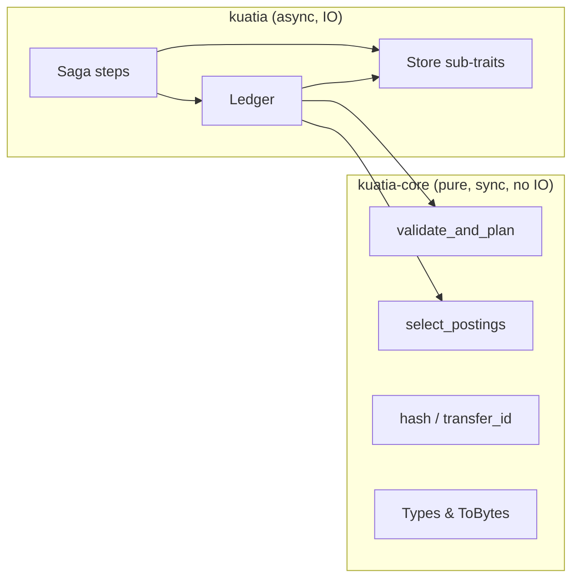
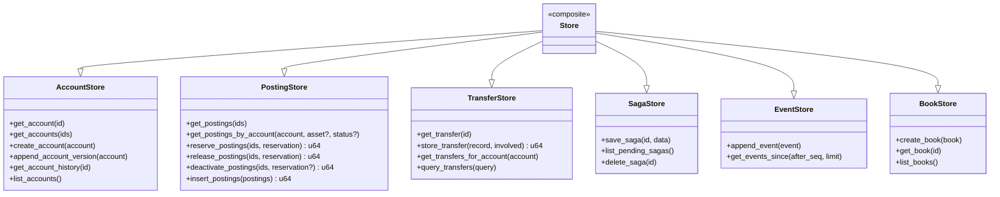
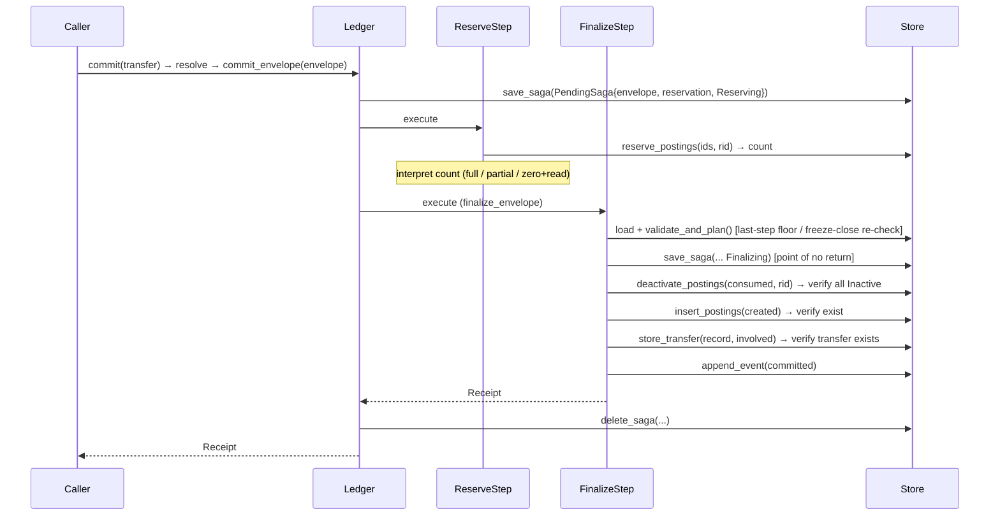
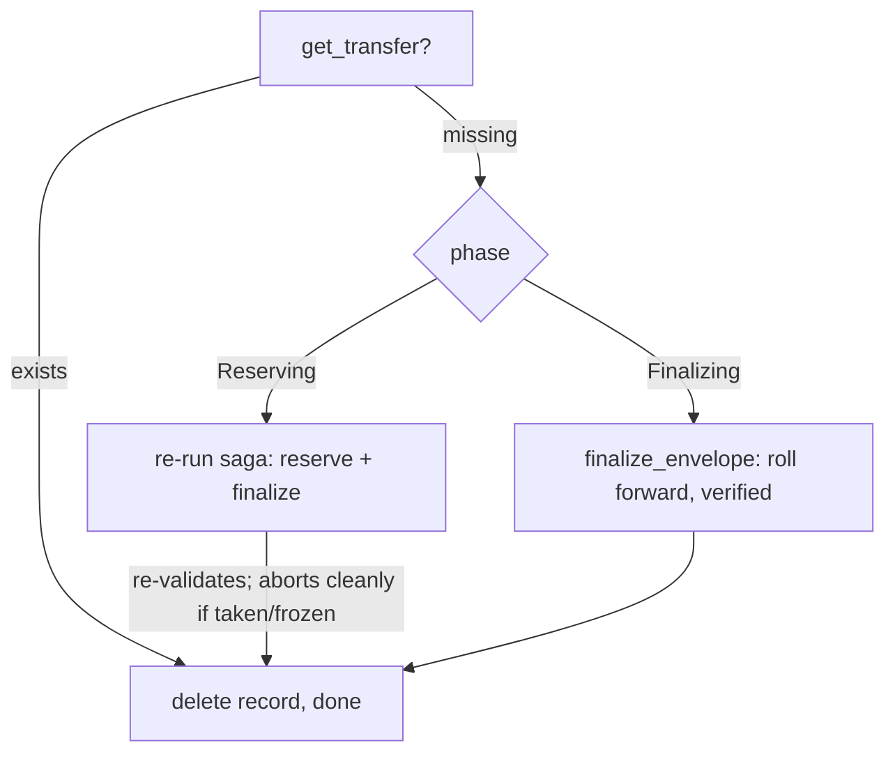
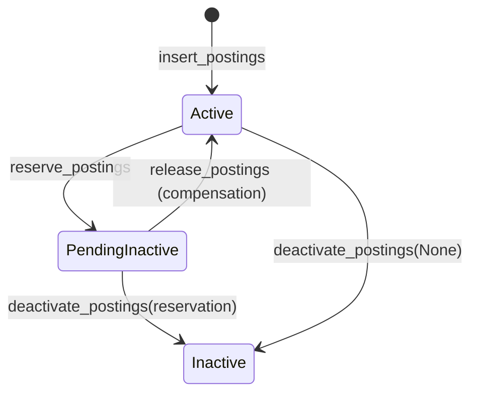

# Architecture Decisions

## UTXO (Unspent Transaction Output)-Style Postings

Value is stored as **postings**: signed amounts of a single asset owned by
exactly one account. A positive posting is value controlled by the account; a
negative posting is an offset position (issuance, external flow, or system
balancing).

Account balance = sum of non-`Inactive` postings (`Active + PendingInactive`)
for that (account, asset) pair. There is no mutable balance field to drift out
of sync.

Consumed postings are marked inactive but never deleted, preserving a full
audit trail.

## Pure Core / Async Layer Separation



**kuatia-core** contains all validation logic with no IO, no async runtime, and
near-zero dependencies. It can be tested with golden vectors, replayed
deterministically, and embedded in `no_std` environments.

**kuatia** adds the async `Store` trait (used as `dyn Store` via trait objects)
and composes the saga commit pipeline. The `Ledger` struct is non-generic: it
holds an `Arc<dyn Store>`, which allows the `legend!` macro to define saga
types with concrete `LedgerCtx`.

This separation keeps the auditable heart of the system deterministic and
independently testable.

## Store Sub-Trait Architecture

The `Store` trait is a composite of focused sub-traits, each responsible for a
single domain. Every write method is a **dumb instruction**: it applies one
update and returns the number of affected rows (or an I/O error). It never
interprets the count, decides state, enforces idempotency, or compensates. The
saga does.



There is no single atomic commit boundary. A commit is a sequence of the dumb
primitives above (`reserve_postings`, `deactivate_postings`, `insert_postings`,
`store_transfer`, `append_event`), each its own atomic update and each
idempotent. The saga sequences them and interprets their counts; a crash
mid-sequence is completed by roll-forward recovery (see below).

The store only persists and reads. All domain logic (balance computation,
validation, policy enforcement, and the interpretation of primitive counts)
lives in the Ledger/saga and `kuatia-core`.

## Saga Commit Pipeline

Every commit is the envelope saga. `commit(transfer)` resolves the intent into
a concrete envelope (read-only), then runs `commit_envelope`, which persists a
write-ahead `PendingSaga` record (phase `Reserving`) and drives **two** steps.
Validation lives inside the finalize step so it runs as late as possible,
immediately before the writes.



On in-process failure before the point of no return, legend compensates in LIFO
order (finalize is a no-op if nothing committed; reserve runs
`release_postings`). Once the finalize step has marked the saga `Finalizing`
and begun deactivating, the half-applied commit is **rolled forward** by
recovery
rather than compensated (see below).

## Durable Crash Recovery

There is no single atomic transaction, so crash-safety comes from a
phase-tracked write-ahead record plus idempotent roll-forward.
`commit_envelope` persists a `PendingSaga {envelope, reservation, phase}` via
`SagaStore` **before** the saga mutates anything (`phase = Reserving`); the
finalize step bumps it to `Finalizing` after validation passes and just before
the consumed postings start turning `Inactive`. The record is deleted only when
the transfer is committed or the commit was cleanly abandoned before finalize.

`Ledger::recover()` (call on startup) re-completes any surviving pending saga,
**branching on the persisted phase** so it never commits something that did not
validate or consume postings it does not own:



- A **`Reserving`** saga had not necessarily validated, so recovery re-runs the
  real saga, which re-reserves and **re-validates** against current state. If
  the postings were taken by another transfer, or an account was frozen, it
  aborts cleanly (nothing commits) and the record is deleted.
- A **`Finalizing`** saga had already validated and owns its postings (it
  reached the point of no return), so recovery rolls it forward through the
  verified `finalize_envelope`, which checks every end-state and only
  creates/stores once **all** consumed postings are confirmed `Inactive` (the
  double-spend guard).

Recovery is roll-forward, not rollback, so the reservation protocol never
leaves orphaned `PendingInactive` postings for a separate reconciliation pass.

`reverse()` builds a reversal envelope and runs the same `commit_envelope`
path. There is no separate raw/atomic entry point.

## Content-Addressed Transfers

`EnvelopeId` is the double-SHA-256 of a transfer's canonical binary
serialization. This serves two purposes:

- **Idempotency**: committing the same transfer twice returns the cached
  receipt instead of applying it again.
- **Tamper evidence**: any modification to a transfer's data changes its ID.

All domain types implement deterministic binary serialization (`ToBytes` trait)
using big-endian encoding with a version prefix (`CANONICAL_VERSION = 1`).

## Append-Only Account Versioning

Accounts are never modified in place. Each account mutation (freeze, unfreeze,
close, or a policy/flags change) appends a new snapshot with an incremented
`version` field (starts at 1 on creation). Note that transfers do **not** bump
account versions: balances are derived from postings, not stored on the
account.

The store enforces that each new version is exactly `current + 1`, preventing
gaps or overwrites. The full version history is queryable via
`account_history()`.

## Account Snapshot Pinning

Transfers can carry `AccountSnapshotId` values: pairs of
`(AccountId, snapshot_hash)` recording which account versions the transfer was
validated against.

During validation, if snapshots are provided, the current account state is
hashed and compared. A mismatch produces `AccountVersionMismatch`, preventing
TOCTOU (Time-Of-Check to Time-Of-Use) races where an account is mutated between
load and apply.

The `commit()` convenience method auto-populates snapshots when none are
provided.

## Per-Asset Conservation

The conservation invariant is: for each asset, the sum of consumed posting
values must equal the sum of created posting values.

Conservation boundaries are **per-asset only**. The `book` field on transfers
and accounts is a transfer policy scope (which accounts/assets may
participate). It does not affect conservation enforcement, and it does not
partition balances.

## Account Policies

Each account has a policy controlling its balance floor and whether it may hold
negative postings:

| Policy | Balance floor | Negative postings |
|--------|--------------|-------------------|
| `NoOverdraft` | `>= 0` | No |
| `CappedOverdraft { floor }` | `>= floor` | Yes (down to floor) |
| `UncappedOverdraft` | None | Yes (unbounded) |
| `SystemAccount` | None | Yes |
| `ExternalAccount` | None | Yes |

An overdraft is a **negative posting** assigned to the account to cover a
shortfall. Only `NoOverdraft` forbids negative postings; validation rejects a
negative posting on a `NoOverdraft` account. `CappedOverdraft`'s floor (checked
in validation) bounds the negative balance; the other policies are unbounded.

## The CappedOverdraft Floor Under Concurrency

`CappedOverdraft` accounts have a balance floor that is not backed by the UTXO
model alone: two concurrent transfers could each pass validation but together
push the balance below the floor (write-skew).

Under the dumb-storage model the floor (and the freeze/close snapshot check) is
re-validated **as the last thing the finalize step does before it writes**: the
finalize step re-loads balances and account versions and re-runs
`validate_and_plan` immediately before `deactivate_postings`. This is the
tightest best-effort: the check-to-write window is one step, not the whole
saga's lifetime, and it also runs on the recovery path. It is **not strictly
atomic**, though. Without folding the check into the write itself (a CAS) or
serializing per account, a concurrent commit landing in that last sub-step gap
can still slip through. Double-spend safety is unaffected and holds
unconditionally: the reservation protocol (`reserve_postings` is a single
atomic conditional update, so two sagas cannot both claim the same posting)
prevents
consuming a posting twice. Only the floor on a `CappedOverdraft` account is
best-effort. This tradeoff is recorded in
[doc/adr/0003-dumb-storage-saga-recovery.md](adr/0003-dumb-storage-saga-recovery.md).

`NoOverdraft` is fully UTXO-backed (you can only spend postings you own), and
the unconstrained policies have no floor to violate.

## No Sequential Hash Chain

An earlier design linked each transfer to its predecessor via a hash chain,
enforcing total ordering. This was removed because:

- UTXO double-spend prevention already prevents reordering attacks (a posting
  can only be consumed once).
- Content-addressed transfer IDs provide tamper evidence without chaining.
- Append-only account versioning prevents account state manipulation.
- The chain was a **concurrency bottleneck**: every transfer had to wait for
  its predecessor's hash.

## Posting Selection

The intent layer hides UTXO complexity from callers. Every operation is
expressed as one or more `Movement { from, to, asset, amount }` values. The
resolve step aggregates net debits per (account, asset) across all movements,
then for each pair with a positive net debit, the `select_postings` function
uses a **greedy largest-first** algorithm:

1. Filter to active, positive postings of the target asset.
2. Sort by value descending.
3. Accumulate until the sum meets or exceeds the target.

If the selected sum exceeds the target, the resolve step creates a **change
posting** returning the remainder to the sender, exactly like Bitcoin's change
outputs.

Aggregating before selection means multiple movements debiting the same account
share one selection pass, avoiding double-selection of the same postings.

## Posting Lifecycle

Postings follow a three-state lifecycle managed by the saga pipeline:



| State | Available | In balance | Description |
|-------|-----------|------------|-------------|
| **Active** | Yes | Yes | Available for consumption |
| **PendingInactive** | No | Yes | Reserved for a transfer. Reverts to Active on compensation |
| **Inactive** | No | No | Consumed. Kept for audit trail (void) |

### Batch semantics

The batch posting methods are dumb: each id's conditional update is applied
independently, and the method returns the number of rows it changed. There is
no all-or-nothing batch rejection. A posting that does not meet the condition is
simply skipped (it does not count and does not error), so a batch can apply to
some ids and not others. The saga interprets the returned count (full continue,
partial compensate, zero idempotent-replay); the Store never decides.

- **`reserve_postings(ids, rid)`**: flips each `Active` posting to
  `PendingInactive` stamped with `rid`. Each flip is a single atomic conditional
  update; a posting that is not Active is skipped. Returns the number flipped.
- **`release_postings(ids, rid)`**: reverts each `PendingInactive` posting owned
  by `rid` to `Active`. Others are skipped. Returns the number reverted.

Each posting's update is atomic on its own row, so this enables shard-local
writes with no cross-shard coordination. Atomicity is per posting, not across
the batch.

## Saga Composition

### Internal pipeline steps

The envelope saga is two `legend::Step` implementations operating on
`LedgerCtx` (resolution runs before the saga, in `Ledger::commit`):

| Step | Execute | Compensate | Retry |
|------|---------|------------|-------|
| `ReservePostingsStep` | Reserve postings `Active → PendingInactive`, interpret the count | Release back to `Active` | 3 retries |
| `FinalizeTransferStep` | `Ledger::finalize_envelope`: re-validate (last-step floor/freeze guard) → mark `Finalizing` → `deactivate` → `insert` → `store_transfer` → `append_event`, verifying every end-state | `reverse(transfer_id)` | 3 retries |

### High-level composition steps

Higher-level steps compose over the intent-layer API for multi-transfer
workflows:

| Step | Execute | Compensate |
|------|---------|------------|
| `PayMovementStep` | Build pay transfer, `ledger.commit(...)` | `ledger.reverse(receipt.transfer_id)` |
| `DepositMovementStep` | Build deposit transfer, `ledger.commit(...)` | `ledger.reverse(receipt.transfer_id)` |
| `WithdrawMovementStep` | Build withdraw transfer, `ledger.commit(...)` | `ledger.reverse(receipt.transfer_id)` |

### Custom orchestration with legend

You can compose any combination of steps into a saga using the `legend!` macro.
Legend drives the steps in order, retries on transient failures, and
compensates completed steps in reverse (LIFO) on unrecoverable failure.

```rust
use std::sync::Arc;
use legend::legend;
use kuatia::saga::*;

// Define a multi-transfer saga
legend! {
    FundAndPay<LedgerCtx, SagaError> {
        deposit: DepositMovementStep,
        pay: PayMovementStep,
    }
}

// Build and run: Ledger uses Arc<dyn Store>, so LedgerCtx is concrete
let ledger: Arc<Ledger> = /* ... */;
let saga = FundAndPay::new(FundAndPayInputs {
    deposit: DepositInput { to: alice, asset: usd, amount, external: bank },
    pay: PayInput { from: alice, to: bob, asset: usd, amount },
});
let ctx = LedgerCtx::new(ledger.clone());
let result = saga.build(ctx).start().await;

match result {
    ExecutionResult::Completed(e) => { /* all steps succeeded */ }
    ExecutionResult::Failed(_, err) => { /* deposit was compensated */ }
    ExecutionResult::Paused(e) => { /* serialize e for crash recovery */ }
    ExecutionResult::CompensationFailed { .. } => { /* manual intervention */ }
}
```

Since `Ledger` uses `Arc<dyn Store>` internally, `LedgerCtx` is a concrete
type: no generic parameters needed. This is what allows `legend!` to define
saga types directly.

The `LedgerCtx` is serializable: a paused saga can be persisted and resumed
later, enabling crash recovery. On boot, load pending sagas and resume them;
legend will compensate any completed steps that need rollback.

### Reversal

`reverse()` creates a compensating transfer that consumes the original's
created postings and recreates its consumed postings, undoing the operation
while preserving the full audit trail.
