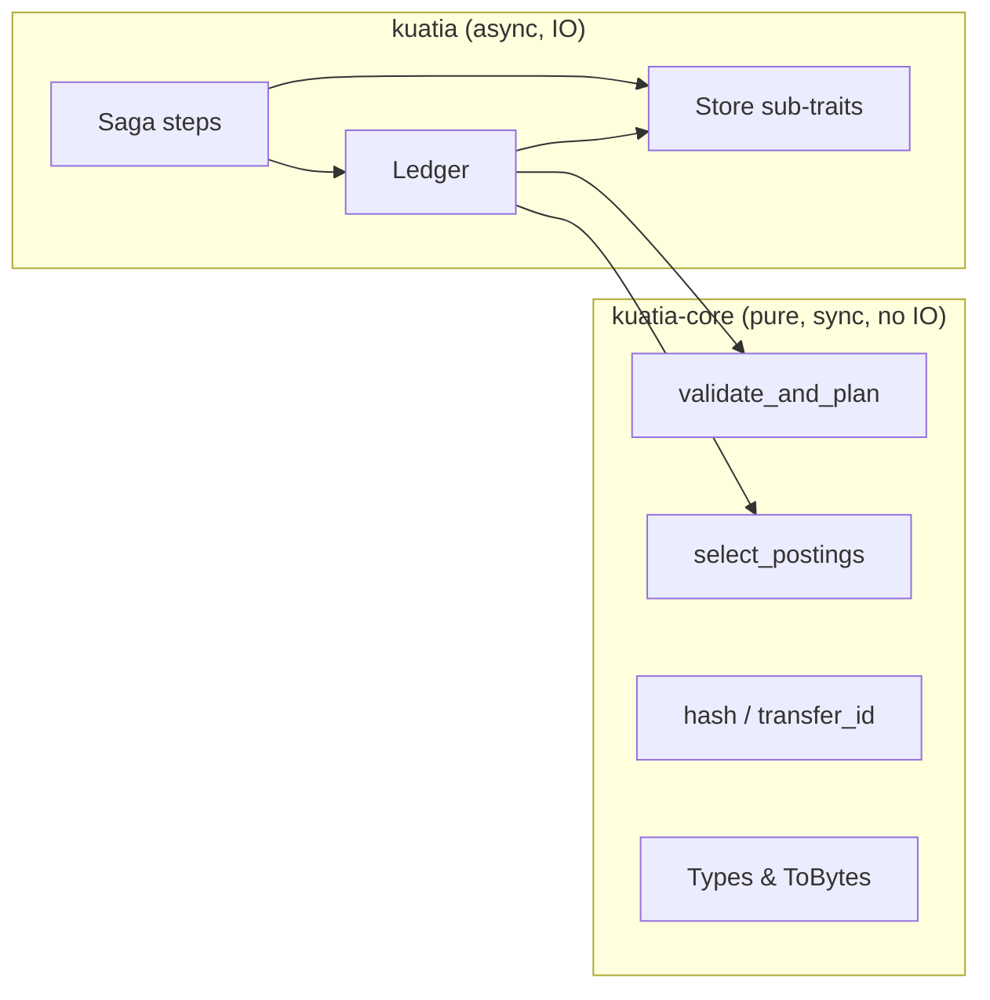
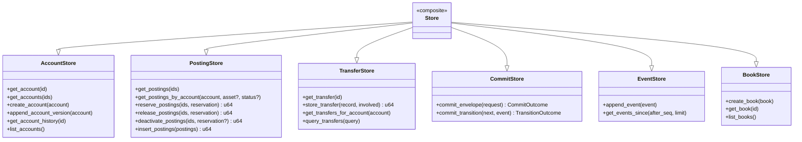
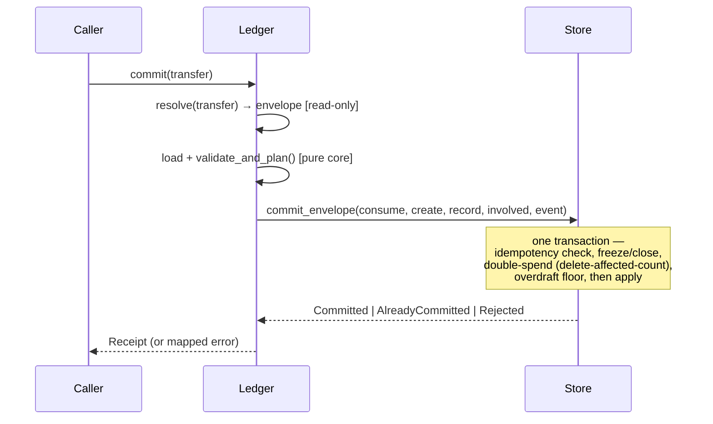
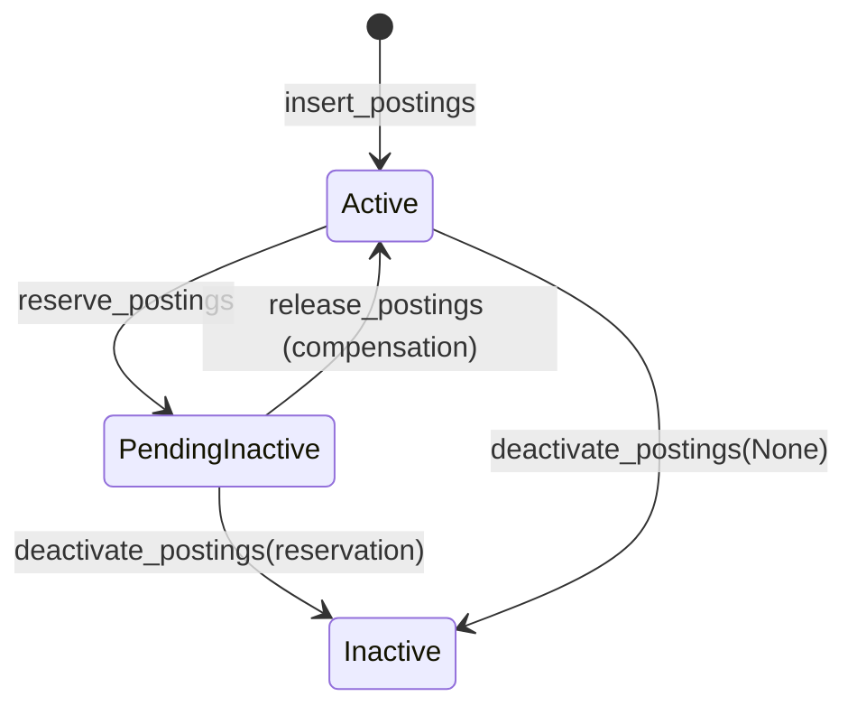

# Architecture Decisions

## UTXO (Unspent Transaction Output)-Style Postings

Value is stored as **postings**: signed amounts of a single asset owned by
exactly one account. A positive posting is value controlled by the account; a
negative posting is an offset position (issuance, external flow, or system
balancing).

Account balance = sum of non-`Inactive` postings (`Active + PendingInactive`)
for that (account, asset) pair. There is no mutable balance field to drift out
of sync.

Consumed postings are marked inactive but never deleted, preserving a full
audit trail.

## Pure Core / Async Layer Separation


```mermaid
graph LR
    subgraph "kuatia-core (pure, sync, no IO)"
        V[validate_and_plan]
        S[select_postings]
        H[hash / transfer_id]
        T[Types & ToBytes]
    end
    subgraph "kuatia (async, IO)"
        L[Ledger]
        ST[Store sub-traits]
        SG[Saga steps]
    end
    L --> V
    L --> S
    L --> ST
    SG --> L
    SG --> ST
```

**kuatia-core** contains all validation logic with no IO, no async runtime, and
near-zero dependencies. It can be tested with golden vectors, replayed
deterministically, and embedded in `no_std` environments.

**kuatia** adds the async `Store` trait (used as `dyn Store` via trait objects)
and the commit engine. The `Ledger` struct is non-generic: it holds an
`Arc<dyn Store>`.

This separation keeps the auditable heart of the system deterministic and
independently testable.

## Store Sub-Trait Architecture

The `Store` trait is a composite of focused sub-traits, each responsible for a
single domain. A transfer is committed atomically through `CommitStore`
(`commit_envelope` / `commit_transition`); the remaining posting/account write
methods are **dumb instructions** used by reads and setup: each applies one
update and returns the number of affected rows (or an I/O error), never
interpreting the count.


```mermaid
classDiagram
    class AccountStore {
        +get_account(id)
        +get_accounts(ids)
        +create_account(account)
        +append_account_version(account)
        +get_account_history(id)
        +list_accounts()
    }
    class PostingStore {
        +get_postings(ids)
        +get_postings_by_account(account, asset?, status?)
        +reserve_postings(ids, reservation) u64
        +release_postings(ids, reservation) u64
        +deactivate_postings(ids, reservation?) u64
        +insert_postings(postings) u64
    }
    class TransferStore {
        +get_transfer(id)
        +store_transfer(record, involved) u64
        +get_transfers_for_account(account)
        +query_transfers(query)
    }
    class CommitStore {
        +commit_envelope(request) CommitOutcome
        +commit_transition(next, event) TransitionOutcome
    }
    class EventStore {
        +append_event(event)
        +get_events_since(after_seq, limit)
    }
    class BookStore {
        +create_book(book)
        +get_book(id)
        +list_books()
    }
    class Store {
        <<composite>>
    }
    Store --|> AccountStore
    Store --|> PostingStore
    Store --|> TransferStore
    Store --|> CommitStore
    Store --|> EventStore
    Store --|> BookStore
```

A whole transfer is committed atomically by `CommitStore::commit_envelope`, so
there is a single atomic commit boundary. The store enforces the stateful guards
(double-spend, freeze/close, overdraft floor) inside that transaction; the pure
core validates everything else first. Balance computation, validation, and the
resolve decision live in the Ledger and `kuatia-core`.

## Atomic Commit

`commit(transfer)` resolves the intent into a concrete envelope (read-only),
validates it against loaded state in the pure core, then hands the validated
effects to `store.commit_envelope(..)`, which applies them in one transaction.


```mermaid
sequenceDiagram
    participant C as Caller
    participant L as Ledger
    participant S as Store

    C->>L: commit(transfer)
    L->>L: resolve(transfer) → envelope   [read-only]
    L->>L: load + validate_and_plan()     [pure core]
    L->>S: commit_envelope(consume, create, record, involved, event)
    Note over S: one transaction —<br/>idempotency check, freeze/close,<br/>double-spend (delete-affected-count),<br/>overdraft floor, then apply
    S-->>L: Committed | AlreadyCommitted | Rejected
    L-->>C: Receipt (or mapped error)
```

Inside the transaction the store checks idempotency (an already-stored transfer
returns its receipt), then re-checks the three stateful guards strictly: the
consumed postings must still be live (the delete-affected-count is the atomic
single-winner claim), the involved accounts must not be frozen or closed, and an
overdraft-forbidding account's projected balance must stay non-negative (summed
in Rust from the live rows). A domain rejection is a typed `CommitRejection` the
ledger maps to a `LedgerError`; nothing is applied on a rejection.

Because the write is all-or-nothing, a crash either applied the whole commit or
none of it. There is no write-ahead record and no `recover()` step. An account
transition (freeze/unfreeze/close) is the same shape: `commit_transition`
appends the new version and its lifecycle event in one transaction.

This replaced an earlier saga pipeline. A saga is the right tool when a workflow
spans resources that cannot share a transaction (multiple services or a sharded
store); here every step lived behind one transactional store, so one ACID
transaction was the simpler, stricter primitive. If a backend ever shards its
data, the saga returns *inside* that backend's `commit_envelope`, not in the
ledger core. See
[ADR-0023](adr/0023-atomic-storage-commit.md) ("When a saga is the right tool").

`reverse()` builds a reversal envelope and runs the same `commit_envelope` path.
Multiple transfers compose into an all-or-nothing workflow through
`saga::run_movements`, which commits them in order and reverses the committed
ones LIFO on failure.

## Content-Addressed Transfers

`EnvelopeId` is the double-SHA-256 of a transfer's canonical binary
serialization. This serves two purposes:

- **Idempotency**: committing the same transfer twice returns the cached
  receipt instead of applying it again.
- **Tamper evidence**: any modification to a transfer's data changes its ID.

All domain types implement deterministic binary serialization (`ToBytes` trait)
using big-endian encoding with a version prefix (`CANONICAL_VERSION = 4`).

## Append-Only Account Versioning

Accounts are never modified in place. Each account mutation (freeze, unfreeze,
close, or a flags change) appends a new snapshot with an incremented
`version` field (starts at 1 on creation). Note that transfers do **not** bump
account versions: balances are derived from postings, not stored on the
account.

The store enforces that each new version is exactly `current + 1`, preventing
gaps or overwrites. The full version history is queryable via
`account_history()`.

## Account Snapshot Pinning

Transfers can carry `AccountSnapshotId` values: pairs of
`(AccountId, snapshot_hash)` recording which account versions the transfer was
validated against.

During validation, if snapshots are provided, the current account state is
hashed and compared. A mismatch produces `AccountVersionMismatch`, preventing
TOCTOU (Time-Of-Check to Time-Of-Use) races where an account is mutated between
load and apply.

The `commit()` convenience method auto-populates snapshots when none are
provided.

## Per-Asset Conservation

The conservation invariant is: for each asset, the sum of consumed posting
values must equal the sum of created posting values.

Conservation boundaries are **per-asset only**. The `book` field on transfers
and accounts is a transfer policy scope (which accounts/assets may
participate). It does not affect conservation enforcement, and it does not
partition balances.

## Account Balance Constraint

The single per-account balance constraint is the `AccountFlags` bit
`DEBIT_MUST_NOT_EXCEED_CREDIT`:

| Flag | Balance | Negative postings |
|------|---------|-------------------|
| unset (default) | may go negative, unbounded | Yes (unbounded) |
| `DEBIT_MUST_NOT_EXCEED_CREDIT` | `>= 0` | No |

By default overdraft is allowed. An overdraft is a **negative posting** assigned
to the account to cover a shortfall; a debit short of the account's positive
postings is covered by a negative offset posting, and the transfer is recorded
as long as it conserves value per asset. Credit-line limits are an application
concern, not ledger-enforced.

With the flag set the account's debits may not exceed its credits: its balance
may not go negative and it may not hold a negative posting. Validation rejects a
negative posting on such an account. Use
`Account::debit_must_not_exceed_credit(id)` to set it and
`Account::forbids_overdraft()` to query it.

## The Debit-Must-Not-Exceed-Credit Constraint Under Concurrency

An account that forbids overdraft has a balance floor at zero that is not backed
by the UTXO model alone: two concurrent transfers could each pass a snapshot
validation but together push the balance negative (write-skew).

Under the atomic-commit model (ADR-0023) the floor and the freeze/close checks
are re-run **inside the commit transaction**, after the consumed postings are
deleted and the created ones inserted, so they see the true post-commit state. A
projected-negative balance on an overdraft-forbidding account aborts the whole
transaction. On PostgreSQL the involved account-head rows are taken `FOR UPDATE`
before the live-posting writes, serializing concurrent commits that touch the
same account; on SQLite the single write transaction serializes writers. The
floor is therefore **strict**, not best-effort. Double-spend safety comes from
the same transaction: deleting a consumed live row is the atomic single-winner
claim, so two commits cannot both spend it. This supersedes the best-effort
tradeoff recorded in
[doc/adr/0003-dumb-storage-saga-recovery.md](adr/0003-dumb-storage-saga-recovery.md);
see [doc/adr/0023-atomic-storage-commit.md](adr/0023-atomic-storage-commit.md).

An overdraft-permitting account has no floor to violate.

## No Sequential Hash Chain

An earlier design linked each transfer to its predecessor via a hash chain,
enforcing total ordering. This was removed because:

- UTXO double-spend prevention already prevents reordering attacks (a posting
  can only be consumed once).
- Content-addressed transfer IDs provide tamper evidence without chaining.
- Append-only account versioning prevents account state manipulation.
- The chain was a **concurrency bottleneck**: every transfer had to wait for
  its predecessor's hash.

## Posting Selection

The intent layer hides UTXO complexity from callers. Every operation is
expressed as one or more `Movement { from, to, asset, amount }` values. The
resolve step aggregates net debits per (account, asset) across all movements,
then for each pair with a positive net debit, the `select_postings` function
uses a **greedy largest-first** algorithm:

1. Filter to active, positive postings of the target asset.
2. Sort by value descending.
3. Accumulate until the sum meets or exceeds the target.

If the selected sum exceeds the target, the resolve step creates a **change
posting** returning the remainder to the sender, exactly like Bitcoin's change
outputs.

Aggregating before selection means multiple movements debiting the same account
share one selection pass, avoiding double-selection of the same postings.

## Posting Lifecycle

A committed transfer moves a posting straight from `Active` to `Inactive` inside
the atomic commit (the live row is deleted). The intermediate `PendingInactive`
(reserved) state and the `reserve_postings`/`release_postings` primitives remain
as generic single-winner claim operations, unused by the commit path:


```mermaid
stateDiagram-v2
    [*] --> Active: insert_postings
    Active --> PendingInactive: reserve_postings
    PendingInactive --> Active: release_postings (compensation)
    PendingInactive --> Inactive: deactivate_postings(reservation)
    Active --> Inactive: deactivate_postings(None)
```

| State | Available | In balance | Description |
|-------|-----------|------------|-------------|
| **Active** | Yes | Yes | Available for consumption |
| **PendingInactive** | No | Yes | Reserved for a transfer. Reverts to Active on compensation |
| **Inactive** | No | No | Consumed. Kept for audit trail (void) |

### Batch semantics

The batch posting methods are dumb: each id's conditional update is applied
independently, and the method returns the number of rows it changed. There is
no all-or-nothing batch rejection. A posting that does not meet the condition is
simply skipped (it does not count and does not error), so a batch can apply to
some ids and not others. The caller interprets the returned count; the Store
never decides.

- **`reserve_postings(ids, rid)`**: flips each `Active` posting to
  `PendingInactive` stamped with `rid`. Each flip is a single atomic conditional
  update; a posting that is not Active is skipped. Returns the number flipped.
- **`release_postings(ids, rid)`**: reverts each `PendingInactive` posting owned
  by `rid` to `Active`. Others are skipped. Returns the number reverted.

Each posting's update is atomic on its own row, so this enables shard-local
writes with no cross-shard coordination. Atomicity is per posting, not across
the batch.

## Multi-Transfer Composition

A single commit is already atomic in the store, so composing several transfers
into one all-or-nothing workflow (an FX trade, a multi-leg settlement) needs only
a thin runner, not a saga VM. `saga::run_movements` commits a list of
`Movement`s in order and, on the first failure, reverses the already-committed
receipts LIFO via `ledger.reverse(..)`:

```rust
use std::sync::Arc;
use kuatia::saga::{DepositInput, Movement, PayInput, run_movements};

let ledger: Arc<Ledger> = /* ... */;
let receipts = run_movements(&ledger, &[
    Movement::Deposit(DepositInput { to: alice, asset: usd, amount, external: bank }),
    Movement::Pay(PayInput { from: alice, to: bob, asset: usd, amount }),
])
.await?;
```

If the pay fails, the deposit is reversed and the original error is returned; a
failing reversal surfaces as `LedgerError::CompensationFailed`.

### Reversal

`reverse()` creates a compensating transfer that consumes the original's
created postings and recreates its consumed postings, undoing the operation
while preserving the full audit trail.
