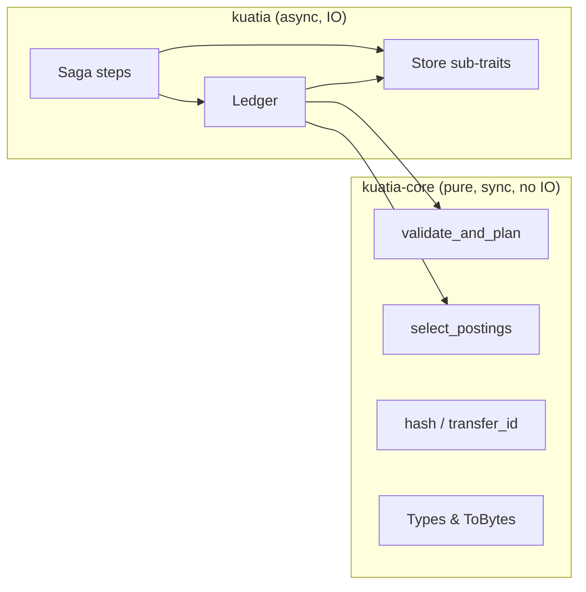
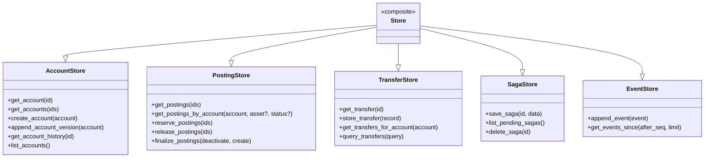
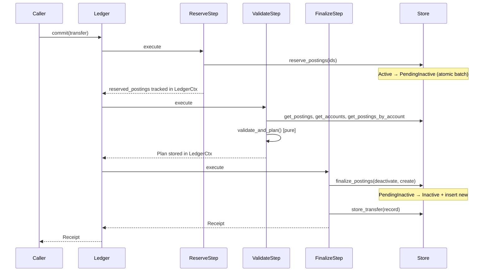
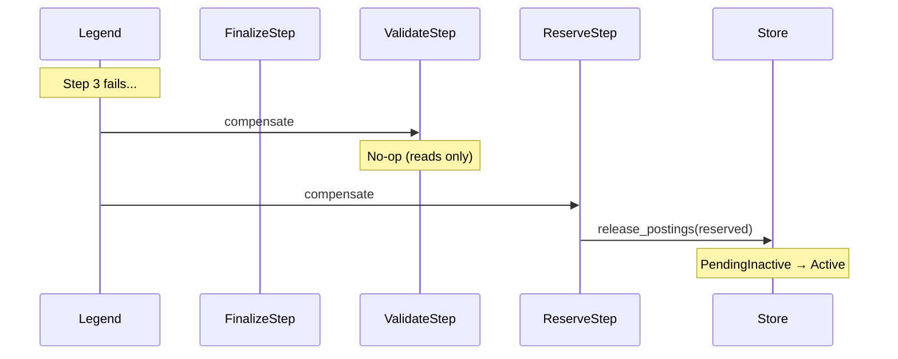
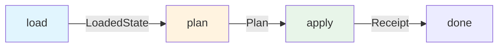
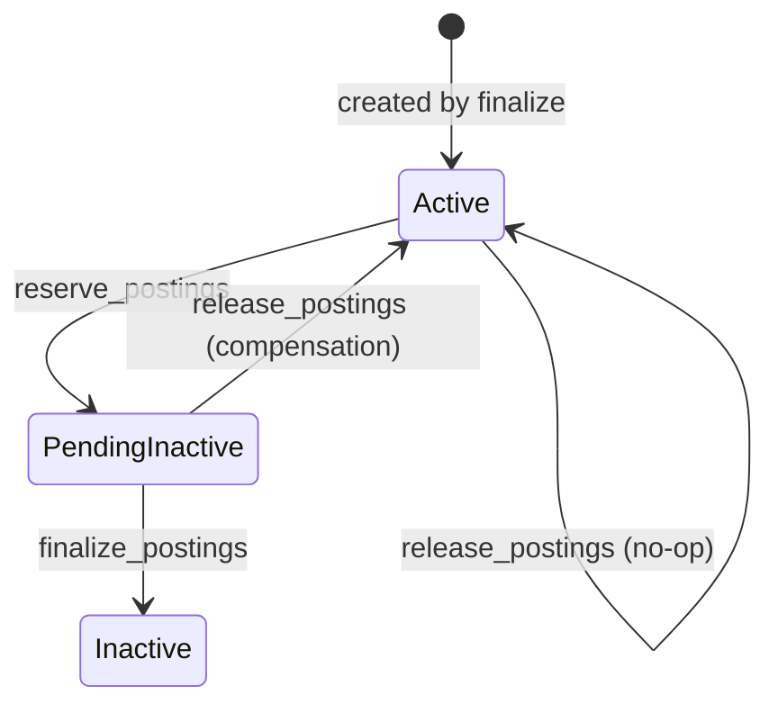

# Architecture Decisions

## UTXO (Unspent Transaction Output)-Style Postings

Value is stored as **postings** — signed amounts of a single asset owned by exactly one account. A positive posting is value controlled by the account; a negative posting is an offset position (issuance, external flow, or system balancing).

Account balance = sum of active postings for that (account, asset) pair. There is no mutable balance field to drift out of sync.

Consumed postings are marked inactive but never deleted, preserving a full audit trail.

## Pure Core / Async Layer Separation


```mermaid
graph LR
    subgraph "kuatia-core (pure, sync, no IO)"
        V[validate_and_plan]
        S[select_postings]
        H[hash / transfer_id]
        T[Types & ToBytes]
    end
    subgraph "kuatia (async, IO)"
        L[Ledger]
        ST[Store sub-traits]
        SG[Saga steps]
    end
    L --> V
    L --> S
    L --> ST
    SG --> L
    SG --> ST
```

**kuatia-core** contains all validation logic with no IO, no async runtime, and near-zero dependencies. It can be tested with golden vectors, replayed deterministically, and embedded in `no_std` environments.

**kuatia** adds the async `Store` trait (used as `dyn Store` via trait objects) and composes the saga commit pipeline. The `Ledger` struct is non-generic — it holds an `Arc<dyn Store>`, which allows the `legend!` macro to define saga types with concrete `LedgerCtx`.

This separation ensures the auditable heart of the system is fully deterministic and independently testable.

## Store Sub-Trait Architecture

The `Store` trait is a composite of five focused sub-traits, each responsible for a single domain:


```mermaid
classDiagram
    class AccountStore {
        +get_account(id)
        +get_accounts(ids)
        +create_account(account)
        +append_account_version(account)
        +get_account_history(id)
        +list_accounts()
    }
    class PostingStore {
        +get_postings(ids)
        +get_postings_by_account(account, asset?, status?)
        +reserve_postings(ids)
        +release_postings(ids)
        +finalize_postings(deactivate, create)
    }
    class TransferStore {
        +get_transfer(id)
        +store_transfer(record)
        +get_transfers_for_account(account)
        +query_transfers(query)
    }
    class SagaStore {
        +save_saga(id, data)
        +list_pending_sagas()
        +delete_saga(id)
    }
    class EventStore {
        +append_event(event)
        +get_events_since(after_seq, limit)
    }
    class Store {
        <<composite>>
    }
    Store --|> AccountStore
    Store --|> PostingStore
    Store --|> TransferStore
    Store --|> SagaStore
    Store --|> EventStore
```

The store only persists and reads — all domain logic (balance computation, validation, policy enforcement) lives in the Ledger and `kuatia-core`.

## Saga Commit Pipeline

The intent layer uses a saga-based pipeline that breaks the commit into four independently-persisted steps:


```mermaid
sequenceDiagram
    participant C as Caller
    participant L as Ledger
    participant R as ReserveStep
    participant V as ValidateStep
    participant F as FinalizeStep
    participant S as Store

    C->>L: commit(transfer)
    L->>R: execute
    R->>S: reserve_postings(ids)
    Note over S: Active → PendingInactive (atomic batch)
    R-->>L: reserved_postings tracked in LedgerCtx

    L->>V: execute
    V->>S: get_postings, get_accounts, get_postings_by_account
    V->>V: validate_and_plan() [pure]
    V-->>L: Plan stored in LedgerCtx

    L->>F: execute
    F->>S: finalize_postings(deactivate, create)
    Note over S: PendingInactive → Inactive + insert new
    F->>S: store_transfer(record)
    F-->>L: Receipt

    L-->>C: Receipt
```

On failure, legend compensates completed steps in LIFO order:


```mermaid
sequenceDiagram
    participant L as Legend
    participant F as FinalizeStep
    participant V as ValidateStep
    participant R as ReserveStep
    participant S as Store

    Note over L: Step 3 fails...
    L->>V: compensate
    Note over V: No-op (reads only)
    L->>R: compensate
    R->>S: release_postings(reserved)
    Note over S: PendingInactive → Active
```

Each step is a small, shard-local operation with automatic compensation on failure. This design avoids cross-shard transactions: no single step touches multiple shards atomically.

## Raw Three-Phase Commit

A lower-level `commit_atomic()` method runs the traditional atomic pipeline in a single pass without reservation. Used internally by `reverse()` and available for callers who need direct control.


```mermaid
graph LR
    A[load] -->|LoadedState| B[plan]
    B -->|Plan| C[apply]
    C -->|Receipt| D[done]
    style A fill:#e1f5fe
    style B fill:#fff3e0
    style C fill:#e8f5e9
```

The three phases can also be called independently: `load()`, `plan()`, `apply()`.

## Content-Addressed Transfers

`EnvelopeId` is the double-SHA-256 of a transfer's canonical binary serialization. This serves two purposes:

- **Idempotency** — committing the same transfer twice returns the cached receipt instead of applying it again.
- **Tamper evidence** — any modification to a transfer's data changes its ID.

All domain types implement deterministic binary serialization (`ToBytes` trait) using big-endian encoding with a version prefix (`CANONICAL_VERSION = 1`).

## Append-Only Account Versioning

Accounts are never modified in place. Each mutation (freeze, unfreeze, close, balance change) appends a new snapshot with an incremented `version` field (starts at 1 on creation).

The store enforces that each new version is exactly `current + 1`, preventing gaps or overwrites. The full version history is queryable via `account_history()`.

## Account Snapshot Pinning

Transfers can carry `AccountSnapshotId` values — pairs of `(AccountId, snapshot_hash)` recording which account versions the transfer was validated against.

During validation, if snapshots are provided, the current account state is hashed and compared. A mismatch produces `AccountVersionMismatch`, preventing TOCTOU (Time-Of-Check to Time-Of-Use) races where an account is mutated between load and apply.

The `commit()` convenience method auto-populates snapshots when none are provided.

## Per-Asset Conservation

The conservation invariant is: for each asset, the sum of consumed posting values must equal the sum of created posting values.

Conservation boundaries are **per-asset only**. The `book` and `code` fields on transfers and accounts are grouping labels for reporting — they do not affect conservation enforcement.

## Account Policies

Each account has a policy controlling its balance floor and whether it may hold negative postings:

| Policy | Balance floor | Negative postings | CAS guard |
|--------|--------------|-------------------|-----------|
| `NoOverdraft` | `>= 0` | No | No |
| `CappedOverdraft { floor }` | `>= floor` | No | Yes |
| `UncappedOverdraft` | None | No | No |
| `SystemAccount` | None | Yes | No |
| `ExternalAccount` | None | Yes | No |

Only `SystemAccount` and `ExternalAccount` may receive negative postings (offset positions). Validation rejects any transfer that would create a negative posting on another account type.

## CAS (Compare-And-Swap) Guards for CappedOverdraft

`CappedOverdraft` accounts have a balance floor that is not backed by the UTXO model alone — two concurrent transfers could each pass validation but together push the balance below the floor (write-skew).

The validation phase emits `cas_guards: Vec<(AccountId, AssetId, Cent)>` for these accounts. The saga pipeline handles isolation via the reserve step (Active → PendingInactive), which prevents concurrent transfers from consuming the same postings.

Other policies do not need CAS guards: `NoOverdraft` is fully UTXO-backed (you can only spend postings you own), and unconstrained policies have no floor to violate.

## No Sequential Hash Chain

An earlier design linked each transfer to its predecessor via a hash chain, enforcing total ordering. This was removed because:

- UTXO double-spend prevention already prevents reordering attacks (a posting can only be consumed once).
- Content-addressed transfer IDs provide tamper evidence without chaining.
- Append-only account versioning prevents account state manipulation.
- The chain was a **concurrency bottleneck** — every transfer had to wait for its predecessor's hash.

## Posting Selection

The intent layer hides UTXO complexity from callers. Every operation is expressed as one or more `Movement { from, to, asset, amount }` values. The resolve step aggregates net debits per (account, asset) across all movements, then for each pair with a positive net debit, the `select_postings` function uses a **greedy largest-first** algorithm:

1. Filter to active, positive postings of the target asset.
2. Sort by value descending.
3. Accumulate until the sum meets or exceeds the target.

If the selected sum exceeds the target, the resolve step creates a **change posting** returning the remainder to the sender — exactly like Bitcoin's change outputs.

Aggregating before selection means multiple movements debiting the same account share one selection pass, avoiding double-selection of the same postings.

## Posting Lifecycle

Postings follow a three-state lifecycle managed by the saga pipeline:


```mermaid
stateDiagram-v2
    [*] --> Active: created by finalize
    Active --> PendingInactive: reserve_postings
    PendingInactive --> Active: release_postings (compensation)
    PendingInactive --> Inactive: finalize_postings
    Active --> Active: release_postings (no-op)
```

| State | Available | In balance | Description |
|-------|-----------|------------|-------------|
| **Active** | Yes | Yes | Available for consumption |
| **PendingInactive** | No | Yes | Reserved for a transfer. Reverts to Active on compensation |
| **Inactive** | No | No | Consumed. Kept for audit trail (void) |

### Batch semantics

`reserve_postings` and `release_postings` operate on batches with atomic semantics — if any posting fails validation, the entire batch is rejected and no state changes.

- **`reserve_postings(ids)`** — all postings must be Active; fails if any is not.
- **`release_postings(ids)`** — fails if any posting is Inactive (void); Active postings are a no-op, PendingInactive postings revert to Active.

This enables shard-local writes: each posting reservation is an independent operation on the posting's shard, with no cross-shard coordination needed.

## Saga Composition

### Internal pipeline steps

The saga pipeline is built from four `legend::Step` implementations that operate on `LedgerCtx`:

| Step | Execute | Compensate | Retry |
|------|---------|------------|-------|
| `ResolveStep` | Convert Transfer intent into concrete Envelope | No-op | No retry |
| `ReservePostingsStep` | Batch reserve postings `Active → PendingInactive` | Release all back to `Active` | 3 retries |
| `ValidateTransferStep` | Load accounts/balances, run `validate_and_plan()` | No-op (reads only) | No retry |
| `FinalizeTransferStep` | `PendingInactive → Inactive`, create postings, store transfer, emit event | `reverse(transfer_id)` | 3 retries |

### High-level composition steps

Higher-level steps compose over the intent-layer API for multi-transfer workflows:

| Step | Execute | Compensate |
|------|---------|------------|
| `PayMovementStep` | Build pay transfer, `ledger.commit(...)` | `ledger.reverse(receipt.transfer_id)` |
| `DepositMovementStep` | Build deposit transfer, `ledger.commit(...)` | `ledger.reverse(receipt.transfer_id)` |
| `WithdrawMovementStep` | Build withdraw transfer, `ledger.commit(...)` | `ledger.reverse(receipt.transfer_id)` |

### Custom orchestration with legend

You can compose any combination of steps into a saga using the `legend!` macro. Legend drives the steps in order, retries on transient failures, and compensates completed steps in reverse (LIFO) on unrecoverable failure.

```rust
use std::sync::Arc;
use legend::legend;
use kuatia::saga::*;

// Define a multi-transfer saga
legend! {
    FundAndPay<LedgerCtx, SagaError> {
        deposit: DepositMovementStep,
        pay: PayMovementStep,
    }
}

// Build and run — Ledger uses Arc<dyn Store>, so LedgerCtx is concrete
let ledger: Arc<Ledger> = /* ... */;
let saga = FundAndPay::new(FundAndPayInputs {
    deposit: DepositInput { to: alice, asset: usd, amount, external: bank },
    pay: PayInput { from: alice, to: bob, asset: usd, amount },
});
let ctx = LedgerCtx::new(ledger.clone());
let result = saga.build(ctx).start().await;

match result {
    ExecutionResult::Completed(e) => { /* all steps succeeded */ }
    ExecutionResult::Failed(_, err) => { /* deposit was compensated */ }
    ExecutionResult::Paused(e) => { /* serialize e for crash recovery */ }
    ExecutionResult::CompensationFailed { .. } => { /* manual intervention */ }
}
```

Since `Ledger` uses `Arc<dyn Store>` internally, `LedgerCtx` is a concrete type — no generic parameters needed. This is what allows `legend!` to define saga types directly.

The `LedgerCtx` is serializable — a paused saga can be persisted and resumed later, enabling crash recovery. On boot, load pending sagas and resume them; legend will compensate any completed steps that need rollback.

### Reversal

`reverse()` creates a compensating transfer that consumes the original's created postings and recreates its consumed postings, effectively undoing the operation while preserving the full audit trail.
