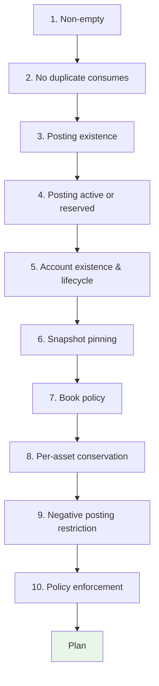
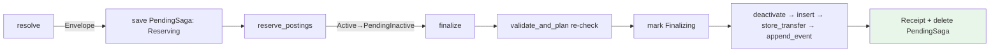
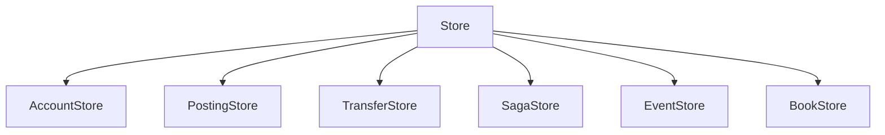
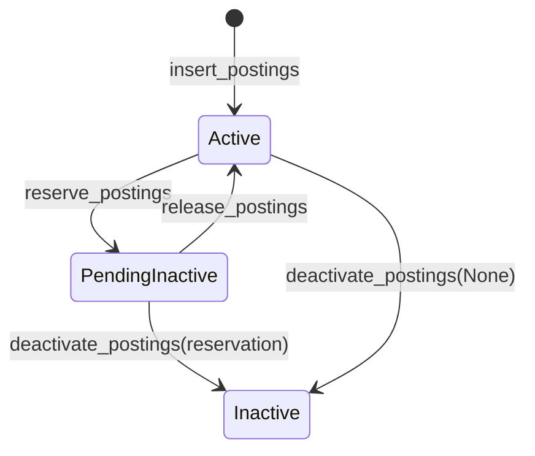

# Crate Reference

## kuatia-core

Pure, sans-IO (Input/Output) decision logic. No async runtime, near-zero
dependencies (`sha2`, `serde`, `bitflags`).

### Modules

| Module | Purpose |
|--------|---------|
| `types` | Domain model: all core types, binary serialization, and `AutoId` generator |
| `validate` | `validate_and_plan()`: single entry point for invariant enforcement |
| `hash` | Double-SHA-256 (Secure Hash Algorithm), canonical encoding helpers, transfer/account hashing |
| `posting_selection` | Greedy largest-first posting selection for the intent layer |

### Key Types

| Type | Description |
|------|-------------|
| `AccountId(i64)` | Stable account identity (snowflake-style, generated in Rust) |
| `AssetId(u32)` | Asset identifier (USD, BTC, etc.). Conservation boundary |
| `EnvelopeId([u8; 32])` | Content-addressed double-SHA-256 of transfer bytes |
| `PostingId { transfer, index }` | Identifies a posting by its creating transfer + position |
| `AccountSnapshotId { account, snapshot_id }` | Account state hash for version pinning |
| `Cent` | Smallest monetary unit (private field, backing integer hidden). Backing is `i64` by default, `i128` under the `i128` feature. Checked arithmetic via `checked_add`, `checked_sub`, `checked_neg`, `checked_sum` returning `Result<Cent, OverflowError>` |
| `OverflowError` | Returned when a `Cent` operation would overflow or underflow |
| `PostingStatus` | Posting lifecycle: `Active`, `PendingInactive`, `Inactive` |
| `Amount` | Parser/formatter for decimal strings. Not stored; use at API boundaries only |
| `Posting` | Signed amount of one asset owned by one account. Has `status: PostingStatus` and `reservation: Option<ReservationId>` (owner token while `PendingInactive`) |
| `ReservationId` | Owner token stamped on a reserved posting so only the reserving saga may finalize/release it |
| `NewPosting` | Posting to be created (no id yet, assigned during validation) |
| `Transfer` | Atomic unit: consumes postings + creates postings + metadata |
| `EnvelopeBuilder` | Fluent builder for `Transfer` construction |
| `Account` | Versioned entity with policy, flags, book, metadata |
| `AccountPolicy` | Balance floor rule: `NoOverdraft`, `CappedOverdraft`, `UncappedOverdraft`, `SystemAccount`, `ExternalAccount` |
| `AccountFlags` | Bitflags: `FROZEN`, `CLOSED` |
| `Metadata` | `BTreeMap<String, Vec<u8>>` for free-form key-value data |
| `Receipt` | Confirmation of a committed transfer (contains `transfer_id`) |
| `AutoId` | Snowflake-inspired i64 ID generator: `[0][40-bit ms][23-bit CRC32 or counter]`. The ms field counts from `KUATIA_EPOCH_MS` (2026-01-01T00:00:00Z), giving ~34.8 years forward. Lives in `kuatia-types::autoid` |

### Validation Invariants

`validate_and_plan(input: PlanInput) -> Result<Plan, ValidationError>` checks,
in order:



1. **Non-empty**: transfer must consume or create at least one posting
2. **No duplicate consumes**: each posting consumed at most once
3. **Posting existence**: every consumed posting exists in state
4. **Posting active or reserved**: consumed postings must be `Active` or
   `PendingInactive` (prevents double-spend)
5. **Account existence & lifecycle**: all referenced accounts exist, not
   frozen, not closed
6. **Snapshot pinning**: account snapshots (if provided) must match current
   state
7. **Book policy**: when a book is loaded, referenced assets/accounts/flags
   must be allowed by the book
8. **Per-asset conservation**: `sum(consumed) == sum(created)` for each asset
9. **Negative posting restriction**: negative postings forbidden only on
   `NoOverdraft` (allowed on overdraft/system/external)
10. **Policy enforcement**: projected balance satisfies account's floor

Output is a `Plan` containing `transfer_id`, `postings_to_deactivate`, and
`postings_to_create`.

---

## kuatia

Async resource layer. Depends on `kuatia-core`, `tokio`, `async-trait`,
`serde`, `legend`.

### Modules

| Module | Purpose |
|--------|---------|
| `kuatia` | `Ledger`: primary API (non-generic, uses `Arc<dyn Store>`), saga commit pipeline, intent layer |
| `store` | `Store` composite trait + sub-traits (`AccountStore`, `PostingStore`, `TransferStore`, `SagaStore`, `EventStore`, `BookStore`) |
| `error` | `StoreError`, `LedgerError`: unified error hierarchy |
| `mem_store` | `InMemoryStore`: in-memory `Store` implementation for tests |
| `saga` | Pipeline steps (reserve, validate, finalize) + high-level legend step adapters |

### Ledger API

#### Commit (the envelope saga)

`commit(transfer)` resolves the intent into an envelope (read-only) then runs
the `EnvelopeSaga` (defined via `legend!`): two steps with automatic retry and
LIFO compensation. The finalize step re-validates as its last action before the
writes, then calls the dumb primitives, interpreting/verifying each count:



Note: `commit`/`commit_envelope`/`reverse`/`recover` require `Arc<Ledger>`.

#### Crash recovery

`recover()` re-completes any `PendingSaga` left by a crash, pushing the
envelope through the idempotent primitives (roll-forward). Call it on startup.

#### Convenience

| Method | Description |
|--------|-------------|
| `commit(transfer)` | Resolve intent → `commit_envelope` (requires `Arc<Ledger>`) |
| `commit_envelope(envelope)` | The one commit path: write-ahead → reserve → finalize (finalize re-validates, then writes); for pre-built/FX envelopes |
| `reverse(transfer_id)` | Builds a compensating envelope and runs `commit_envelope` |
| `recover()` | Force-completes pending sagas after a crash (call on startup) |

#### Intent Layer

Transfers are built via `TransferBuilder` and committed with
`ledger.commit(transfer)`:

| Builder method | Description |
|---------------|-------------|
| `.pay(from, to, asset, amount)` | Single movement between accounts |
| `.deposit(to, asset, amount, external)` | Two movements: offset on external + credit on target |
| `.withdraw(from, asset, amount, external)` | Single movement from account to external |
| `.movement(from, to, asset, amount)` | Raw movement for custom operations |

#### Account Lifecycle

| Method | Description |
|--------|-------------|
| `create_account(account)` | Create account and emit AccountCreated event |
| `freeze(id)` | Set FROZEN flag, increment version, emit AccountFrozen event |
| `unfreeze(id)` | Clear FROZEN flag, increment version, emit AccountUnfrozen event |
| `close(id)` | Set CLOSED flag (requires zero active postings), emit AccountClosed event |

#### Queries

| Method | Description |
|--------|-------------|
| `balance(account, asset)` | Sum of non-Inactive postings (computed by Ledger) |
| `list_accounts()` | All current account snapshots |
| `get_account(id)` | Latest account snapshot |
| `query_transfers(query)` | Paginated, filtered transfer history (by date range, book) |
| `history(account)` | All transfers involving an account |
| `postings(account)` | All postings (any status) |
| `query_postings(query)` | Paginated, filtered postings (by asset, status) |
| `account_history(id)` | All version snapshots |
| `get_events_since(seq, limit)` | Query ledger event log after a sequence number |

### Store Trait

The `Store` trait is a composite of focused sub-traits. Every write method is a
dumb instruction returning the number of affected rows (`u64`); the saga
interprets the count.



- **`AccountStore`**: `get_account`, `get_accounts`, `create_account`,
  `append_account_version`, `get_account_history`, `list_accounts`
- **`PostingStore`**: `get_postings`,
  `get_postings_by_account(account, asset?, status?)`, `query_postings(query)`,
  and the dumb write primitives `reserve_postings(ids, reservation) -> u64`,
  `release_postings(ids, reservation) -> u64`,
  `deactivate_postings(ids, reservation?) -> u64`,
  `insert_postings(postings) -> u64`
- **`TransferStore`**: `get_transfer`,
  `store_transfer(record, involved) -> u64`, `get_transfers_for_account`,
  `query_transfers`
- **`EventStore`**: `append_event` (idempotent on a per-transfer dedup key),
  `get_events_since`
- **`SagaStore`**: `save_saga`, `list_pending_sagas`, `delete_saga`: the
  write-ahead store the saga and `recover()` use
- **`BookStore`**: `create_book`, `get_book`, `list_books`

There is no `CommitStore`/`commit_transfer`: a commit is the saga calling these
primitives in sequence, each idempotent, with crash-safety from write-ahead
recovery rather than a single transaction.

#### Batch posting operations

`reserve_postings`/`release_postings`/`deactivate_postings` apply each id's
conditional update and return how many rows changed (the saga decides what a
short count means):



Each cell is the count a primitive returns (1 = flipped, 0 = no-op / not
applicable). The saga interprets a 0:

| Operation | Active | PendingInactive (this rid) | Inactive |
|-----------|--------|----------------------------|----------|
| `reserve_postings(rid)` | → PendingInactive (1) | 0 | 0 |
| `release_postings(rid)` | 0 | → Active (1) | 0 |
| `deactivate_postings(Some rid)` | 0 | → Inactive (1) | 0 |
| `deactivate_postings(None)` | → Inactive (1) | 0 | 0 |

There is no all-or-nothing batch rejection: a posting whose condition does not
hold is skipped (counted as 0, not an error), so a call can apply to some ids
and not others. Each id's update is atomic on its own row; the batch as a whole
is not. The saga reads the count and decides what to do.

Balance computation lives in the Ledger (`compute_balance`), not the Store.

### Error Hierarchy

```
LedgerError
├── Validation(ValidationError)   // from kuatia-core (includes Overflow)
├── Store(StoreError)             // storage failures
├── Selection(SelectionError)     // insufficient funds (includes Overflow)
├── TransferNotFound
├── PostingNotReversible
├── AccountNotFound
├── AccountNotEmpty              // can't close with active postings
├── AccountAlreadyClosed
├── BookNotFound                 // transfer named a book that does not exist
├── Overflow                     // monetary arithmetic overflow
└── CompensationFailed           // saga compensation failed (original + compensation errors)
```

```
StoreError
├── NotFound(String)
├── AlreadyExists(String)
├── VersionConflict { account, expected, actual }  // append_account_version: stale version
└── Internal(String)
```

The store has no semantic write-outcome errors (no "posting not active",
"reservation mismatch", "cas conflict"). Writes return affected-row counts and
the saga derives meaning from them.

### Saga Steps

#### Envelope pipeline steps (used internally by `commit_envelope`; resolution runs before the saga)

| Step | Execute | Compensate | Retry |
|------|---------|------------|-------|
| `ReservePostingsStep` | `reserve_postings` `Active → PendingInactive`, interpret count | Release back to `Active` | 3 |
| `FinalizeTransferStep` | `Ledger::finalize_envelope`: re-validate (last-step floor/freeze guard) → mark `Finalizing` → `deactivate` → `insert` → `store_transfer` → `append_event`, verifying every end-state | `reverse(transfer_id)` | 3 |

Validation lives inside the finalize step so it runs immediately before the
writes. Recovery (`recover()`) re-uses `finalize_envelope` for `Finalizing`
sagas and re-runs the whole saga for `Reserving` ones.

#### High-level steps (for custom saga composition with `legend!`)

| Step | Execute | Compensate |
|------|---------|------------|
| `PayMovementStep` | Build pay transfer, `ledger.commit(...)` | `ledger.reverse(receipt.transfer_id)` |
| `DepositMovementStep` | Build deposit transfer, `ledger.commit(...)` | `ledger.reverse(receipt.transfer_id)` |

#### Custom orchestration

Compose steps into sagas using `legend!`. The saga executor drives steps in
order with automatic retry and LIFO compensation. `LedgerCtx` is serializable
for crash recovery:

```rust
legend! {
    MyFlow<LedgerCtx, SagaError> {
        deposit: DepositMovementStep,
        pay: PayMovementStep,
    }
}
let ctx = LedgerCtx::new(ledger_arc.clone());
let result = MyFlow::new(inputs).build(ctx).start().await;
```

`LedgerCtx` is concrete (not generic) because `Ledger` uses `Arc<dyn Store>`
internally.
