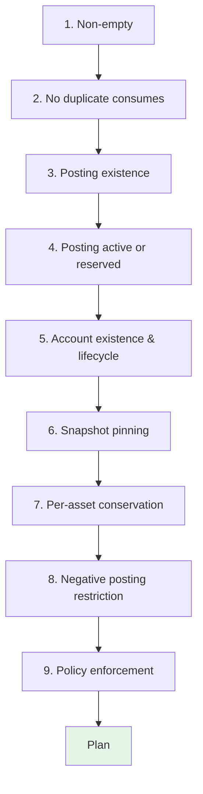
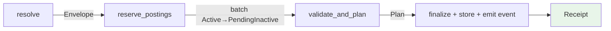
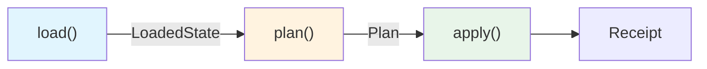
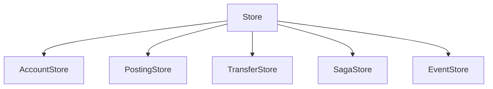
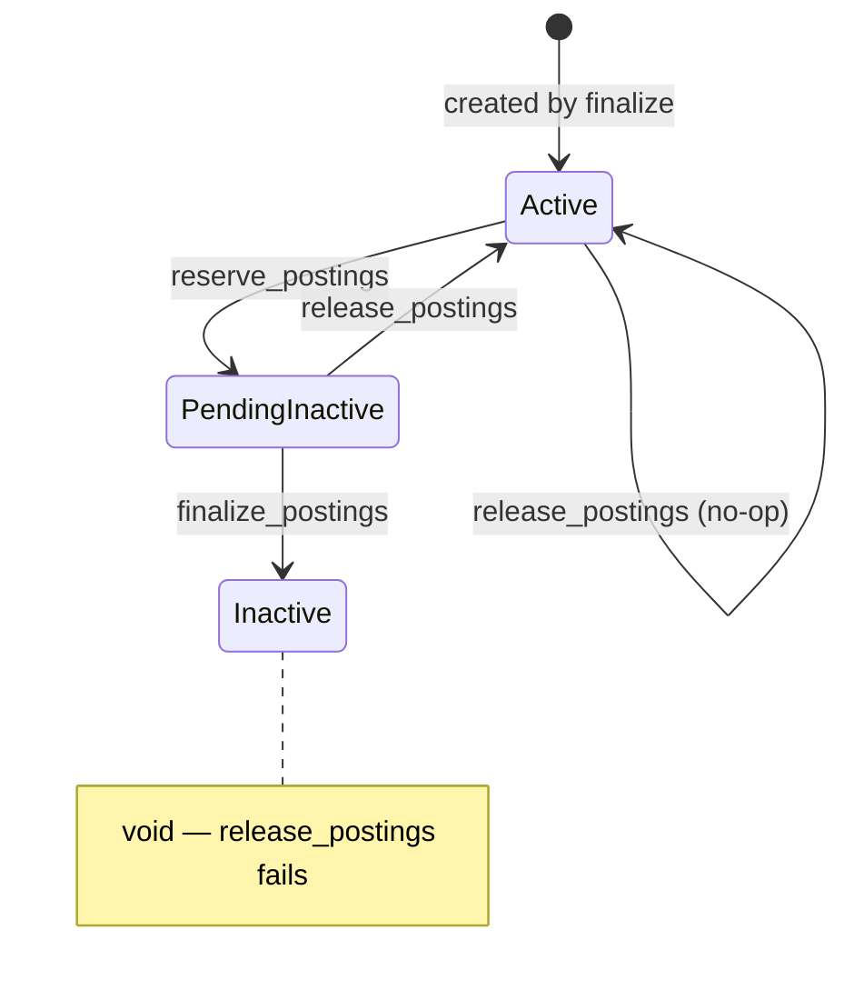

# Crate Reference

## kuatia-core

Pure, sans-IO (Input/Output) decision logic. No async runtime, near-zero dependencies (`sha2`, `serde`, `bitflags`).

### Modules

| Module | Purpose |
|--------|---------|
| `types` | Domain model — all core types, binary serialization, and `AutoId` generator |
| `validate` | `validate_and_plan()` — single entry point for invariant enforcement |
| `hash` | Double-SHA-256 (Secure Hash Algorithm), canonical encoding helpers, transfer/account hashing |
| `posting_selection` | Greedy largest-first posting selection for the intent layer |

### Key Types

| Type | Description |
|------|-------------|
| `AccountId(u128)` | Stable account identity |
| `AssetId(u32)` | Asset identifier (USD, BTC, etc.) — conservation boundary |
| `EnvelopeId([u8; 32])` | Content-addressed double-SHA-256 of transfer bytes |
| `PostingId { transfer, index }` | Identifies a posting by its creating transfer + position |
| `AccountSnapshotId { account, snapshot_id }` | Account state hash for version pinning |
| `Cent(i64)` | Smallest monetary unit (private field). Checked arithmetic via `checked_add`, `checked_sub`, `checked_neg`, `checked_sum` returning `Result<Cent, OverflowError>` |
| `OverflowError` | Returned when a `Cent` operation would overflow or underflow |
| `PostingStatus` | Posting lifecycle: `Active`, `PendingInactive`, `Inactive` |
| `Amount` | Parser/formatter for decimal strings. Not stored — use at API boundaries only |
| `Posting` | Signed amount of one asset owned by one account. Has `status: PostingStatus` |
| `NewPosting` | Posting to be created (no id yet — assigned during validation) |
| `Transfer` | Atomic unit: consumes postings + creates postings + metadata |
| `EnvelopeBuilder` | Fluent builder for `Transfer` construction |
| `Account` | Versioned entity with policy, flags, book, user_data, metadata |
| `AccountPolicy` | Balance floor rule: `NoOverdraft`, `CappedOverdraft`, `UncappedOverdraft`, `SystemAccount`, `ExternalAccount` |
| `AccountFlags` | Bitflags: `FROZEN`, `CLOSED` |
| `UserData` | Fixed 28 bytes (u128 + u64 + u32) for correlation IDs, external refs |
| `Metadata` | `BTreeMap<String, Vec<u8>>` for free-form key-value data |
| `Receipt` | Confirmation of a committed transfer (contains `transfer_id`) |
| `AutoId` | Snowflake-inspired i64 ID generator — `[0][40-bit ms][23-bit CRC32 or counter]`. Lives in `kuatia-types::autoid` |

### Validation Invariants

`validate_and_plan(input: PlanInput) -> Result<Plan, ValidationError>` checks, in order:


```mermaid
graph TD
    A[1. Non-empty] --> B[2. No duplicate consumes]
    B --> C[3. Posting existence]
    C --> D[4. Posting active or reserved]
    D --> E[5. Account existence & lifecycle]
    E --> F[6. Snapshot pinning]
    F --> G[7. Per-asset conservation]
    G --> H[8. Negative posting restriction]
    H --> J[9. Policy enforcement]
    J --> I[Plan]
    style I fill:#e8f5e9
```

1. **Non-empty** — transfer must consume or create at least one posting
2. **No duplicate consumes** — each posting consumed at most once
3. **Posting existence** — every consumed posting exists in state
4. **Posting active or reserved** — consumed postings must be `Active` or `PendingInactive` (prevents double-spend)
5. **Account existence & lifecycle** — all referenced accounts exist, not frozen, not closed
6. **Snapshot pinning** — account snapshots (if provided) must match current state
7. **Per-asset conservation** — `sum(consumed) == sum(created)` for each asset
8. **Negative posting restriction** — negative postings only allowed on `SystemAccount` or `ExternalAccount`
9. **Policy enforcement** — projected balance satisfies account's floor

Output is a `Plan` containing `transfer_id`, `postings_to_deactivate`, `postings_to_create`, and `cas_guards` (Compare-And-Swap guards for concurrency safety).

---

## kuatia

Async resource layer. Depends on `kuatia-core`, `tokio`, `async-trait`, `serde`, `legend`.

### Modules

| Module | Purpose |
|--------|---------|
| `kuatia` | `Ledger` — primary API (non-generic, uses `Arc<dyn Store>`), saga commit pipeline, intent layer |
| `store` | `Store` composite trait + sub-traits (`AccountStore`, `PostingStore`, `TransferStore`, `SagaStore`) |
| `error` | `StoreError`, `LedgerError` — unified error hierarchy |
| `mem_store` | `InMemoryStore` — in-memory `Store` implementation for tests |
| `saga` | Pipeline steps (reserve, validate, finalize) + high-level legend step adapters |

### Ledger API

#### Saga Commit (default for intent layer)

Driven by a `TransferSaga` defined via `legend!` — four steps with automatic retry and LIFO compensation:


```mermaid
graph LR
    A[resolve] -->|Envelope| B[reserve_postings]
    B -->|batch Active→PendingInactive| C[validate_and_plan]
    C -->|Plan| D[finalize + store + emit event]
    D --> E[Receipt]
    style E fill:#e8f5e9
```

Note: `commit` requires `Arc<Ledger>` (takes `self: &Arc<Self>`).

#### Raw Three-Phase Commit


```mermaid
graph LR
    A["load()"] -->|LoadedState| B["plan()"]
    B -->|Plan| C["apply()"]
    C --> D[Receipt]
    style A fill:#e1f5fe
    style B fill:#fff3e0
    style C fill:#e8f5e9
```

`commit_atomic(transfer)` runs all three in one shot. Used by `reverse()` and available for direct callers.

#### Convenience

| Method | Description |
|--------|-------------|
| `commit(transfer)` | Saga pipeline: resolve → reserve → validate → finalize with retry and compensation (requires `Arc<Ledger>`) |
| `commit_atomic(transfer)` | Raw atomic pipeline: load → plan → apply (used by `reverse()`) |
| `reverse(transfer_id)` | Creates compensating transfer that undoes the original |

#### Intent Layer

Transfers are built via `TransferBuilder` and committed with `ledger.commit(transfer)`:

| Builder method | Description |
|---------------|-------------|
| `.pay(from, to, asset, amount)` | Single movement between accounts |
| `.deposit(to, asset, amount, external)` | Two movements: offset on external + credit on target |
| `.withdraw(from, asset, amount, external)` | Single movement from account to external |
| `.movement(from, to, asset, amount)` | Raw movement for custom operations |

#### Account Lifecycle

| Method | Description |
|--------|-------------|
| `create_account(account)` | Create account and emit AccountCreated event |
| `freeze(id)` | Set FROZEN flag, increment version, emit AccountFrozen event |
| `unfreeze(id)` | Clear FROZEN flag, increment version, emit AccountUnfrozen event |
| `close(id)` | Set CLOSED flag (requires zero active postings), emit AccountClosed event |

#### Queries

| Method | Description |
|--------|-------------|
| `balance(account, asset)` | Sum of non-Inactive postings (computed by Ledger) |
| `list_accounts()` | All current account snapshots |
| `get_account(id)` | Latest account snapshot |
| `query_transfers(query)` | Paginated, filtered transfer history (by date range, book) |
| `history(account)` | All transfers involving an account |
| `postings(account)` | All postings (any status) |
| `query_postings(query)` | Paginated, filtered postings (by asset, status) |
| `account_history(id)` | All version snapshots |
| `get_events_since(seq, limit)` | Query ledger event log after a sequence number |

### Store Trait

The `Store` trait is a composite of five focused sub-traits:


```mermaid
graph TB
    Store --> AccountStore
    Store --> PostingStore
    Store --> TransferStore
    Store --> SagaStore
    Store --> EventStore
```

- **`AccountStore`**: `get_account`, `get_accounts`, `create_account`, `append_account_version`, `get_account_history`, `list_accounts`
- **`PostingStore`**: `get_postings`, `get_postings_by_account(account, asset?, status?)`, `query_postings(query)`, `reserve_postings`, `release_postings`, `finalize_postings`
- **`TransferStore`**: `get_transfer`, `store_transfer`, `get_transfers_for_account`, `query_transfers`
- **`EventStore`**: `append_event`, `get_events_since`
- **`SagaStore`**: `save_saga`, `list_pending_sagas`, `delete_saga`

#### Batch posting operations

`reserve_postings` and `release_postings` operate on batches with atomic semantics:


```mermaid
stateDiagram-v2
    [*] --> Active: created by finalize
    Active --> PendingInactive: reserve_postings
    PendingInactive --> Active: release_postings
    PendingInactive --> Inactive: finalize_postings
    Active --> Active: release_postings (no-op)
    note right of Inactive: void — release_postings fails
```

| Operation | Active | PendingInactive | Inactive |
|-----------|--------|-----------------|----------|
| `reserve_postings` | → PendingInactive | **fail** | **fail** |
| `release_postings` | no-op | → Active | **fail** (void) |
| `finalize_postings` | → Inactive | → Inactive | — |

If any posting in the batch fails validation, the entire batch is rejected and no state changes.

Balance computation lives in the Ledger (`compute_balance`), not the Store.

### Error Hierarchy

```
LedgerError
├── Validation(ValidationError)   // from kuatia-core (includes Overflow)
├── Store(StoreError)             // storage failures
├── Selection(SelectionError)     // insufficient funds (includes Overflow)
├── TransferNotFound
├── PostingNotReversible
├── AccountNotFound
├── AccountNotEmpty              // can't close with active postings
├── AccountAlreadyClosed
├── Overflow                     // monetary arithmetic overflow
└── CompensationFailed           // saga compensation failed (original + compensation errors)
```

```
StoreError
├── NotFound(String)
├── AlreadyExists(String)
├── VersionConflict { account, expected, actual }
├── Internal(String)
├── PostingNotActive(PostingId)   // reserve_postings: posting not Active
└── PostingInactive(PostingId)    // release_postings: posting is void
```

### Saga Steps

#### Pipeline steps (used internally by `commit`)

| Step | Execute | Compensate | Retry |
|------|---------|------------|-------|
| `ResolveStep` | Convert Transfer intent into Envelope | No-op | None |
| `ReservePostingsStep` | Batch reserve `Active → PendingInactive` | Batch release back to `Active` | 3 |
| `ValidateTransferStep` | Load state, `validate_and_plan()` | No-op | None |
| `FinalizeTransferStep` | Finalize postings, store transfer, emit event | `reverse(transfer_id)` | 3 |

#### High-level steps (for custom saga composition with `legend!`)

| Step | Execute | Compensate |
|------|---------|------------|
| `PayMovementStep` | Build pay transfer, `ledger.commit(...)` | `ledger.reverse(receipt.transfer_id)` |
| `DepositMovementStep` | Build deposit transfer, `ledger.commit(...)` | `ledger.reverse(receipt.transfer_id)` |
| `WithdrawMovementStep` | Build withdraw transfer, `ledger.commit(...)` | `ledger.reverse(receipt.transfer_id)` |

#### Custom orchestration

Compose steps into sagas using `legend!`. The saga executor drives steps in order with automatic retry and LIFO compensation. `LedgerCtx` is serializable for crash recovery:

```rust
legend! {
    MyFlow<LedgerCtx, SagaError> {
        deposit: DepositMovementStep,
        pay: PayMovementStep,
    }
}
let ctx = LedgerCtx::new(ledger_arc.clone());
let result = MyFlow::new(inputs).build(ctx).start().await;
```

`LedgerCtx` is concrete (not generic) because `Ledger` uses `Arc<dyn Store>` internally.
