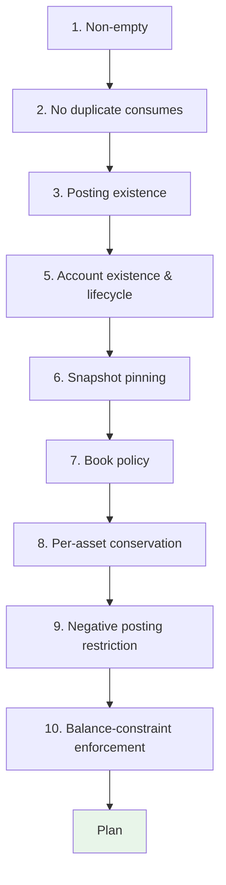
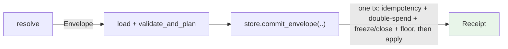
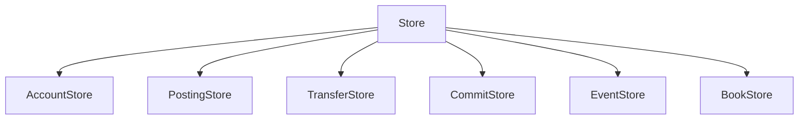
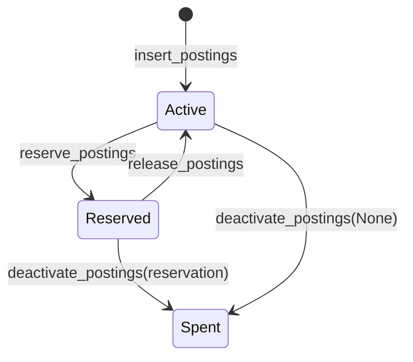

# Crate Reference

## kuatia-core

Pure, sans-IO (Input/Output) decision logic. No async runtime, near-zero
dependencies (`sha2`, `serde`, `bitflags`).

### Modules

| Module | Purpose |
|--------|---------|
| `types` | Domain model: all core types, binary serialization, and `AutoId` generator |
| `validate` | `validate_and_plan()`: single entry point for invariant enforcement |
| `hash` | Double-SHA-256 (Secure Hash Algorithm), canonical encoding helpers, transfer/account hashing |
| `posting_selection` | Greedy largest-first posting selection for the intent layer |

### Key Types

| Type | Description |
|------|-------------|
| `AccountId(i64)` | Stable account identity (snowflake-style, generated in Rust) |
| `AssetId(u32)` | Asset identifier (USD, BTC, etc.). Conservation boundary |
| `EnvelopeId([u8; 32])` | Content-addressed double-SHA-256 of transfer bytes |
| `PostingId { transfer, index }` | Identifies a posting by its creating transfer + position |
| `AccountSnapshotId { account, snapshot_id }` | Account state hash for version pinning |
| `Cent` | Smallest monetary unit (private field, backing integer hidden). Backing is `i64` by default, `i128` under the `i128` feature. Checked arithmetic via `checked_add`, `checked_sub`, `checked_neg`, `checked_sum` returning `Result<Cent, OverflowError>` |
| `OverflowError` | Returned when a `Cent` operation would overflow or underflow |
| `PostingState` | Derived posting lifecycle (from index-table membership, not stored): `Active`, `Reserved(ReservationId)`, `Spent`, `Missing` |
| `PostingFilter` | Read filter over derived posting state: `Active`, `Reserved`, `Live` (Active ∪ Reserved), `All` |
| `Amount` | Parser/formatter for decimal strings. Not stored; use at API boundaries only |
| `Posting` | Immutable signed amount of one asset owned by one account. Carries no lifecycle field; its state is derived from index-table membership (see `PostingState`) |
| `ReservationId` | Owner token recorded in the reserved index by the `reserve_postings`/`release_postings` primitives (unused by the atomic commit path) |
| `NewPosting` | Posting to be created (no id yet, assigned during validation) |
| `Transfer` | Atomic unit: consumes postings + creates postings + metadata |
| `EnvelopeBuilder` | Fluent builder for `Transfer` construction |
| `Account` | Versioned entity with flags, book, metadata. `Account::new(id)` allows overdraft by default; `Account::debit_must_not_exceed_credit(id)` forbids it; `Account::forbids_overdraft()` queries the constraint |
| `AccountFlags` | Bitflags: `FROZEN`, `CLOSED`, `DEBIT_MUST_NOT_EXCEED_CREDIT` (when set, the account's debits may not exceed its credits: balance stays `>= 0`, no negative postings) |
| `Metadata` | `BTreeMap<String, Vec<u8>>` for free-form key-value data |
| `Receipt` | Confirmation of a committed transfer (contains `transfer_id`) |
| `AutoId` | Snowflake-inspired i64 ID generator: `[0][40-bit ms][23-bit CRC32 or counter]`. The ms field counts from `KUATIA_EPOCH_MS` (2026-01-01T00:00:00Z), giving ~34.8 years forward. Lives in `kuatia-types::autoid` |

### Validation Invariants

`validate_and_plan(input: PlanInput) -> Result<Plan, ValidationError>` checks,
in order:


```mermaid
graph TD
    A[1. Non-empty] --> B[2. No duplicate consumes]
    B --> C[3. Posting existence]
    C --> E[5. Account existence & lifecycle]
    E --> F[6. Snapshot pinning]
    F --> BP[7. Book policy]
    BP --> G[8. Per-asset conservation]
    G --> H[9. Negative posting restriction]
    H --> J[10. Balance-constraint enforcement]
    J --> I[Plan]
    style I fill:#e8f5e9
```

1. **Non-empty**: transfer must consume or create at least one posting
2. **No duplicate consumes**: each posting consumed at most once
3. **Posting existence**: every consumed posting exists in the immutable table
   (a `Posting` carries no lifecycle state; double-spend safety is enforced by
   the reserve claim and the finalize "all spent" guard, not here)
5. **Account existence & lifecycle**: all referenced accounts exist, not
   frozen, not closed
6. **Snapshot pinning**: account snapshots (if provided) must match current
   state
7. **Book policy**: when a book is loaded, referenced assets/accounts/flags
   must be allowed by the book
8. **Per-asset conservation**: `sum(consumed) == sum(created)` for each asset
9. **Negative posting restriction**: negative postings forbidden only on
   accounts that forbid overdraft (the `DEBIT_MUST_NOT_EXCEED_CREDIT` flag is
   set); allowed on overdraft-permitting accounts
10. **Balance-constraint enforcement**: for an account that forbids overdraft,
    the projected balance stays `>= 0`

Output is a `Plan` containing `transfer_id`, `postings_to_deactivate`, and
`postings_to_create`.

---

## kuatia

Async resource layer. Depends on `kuatia-core`, `tokio`, `async-trait`,
`serde`.

### Modules

| Module | Purpose |
|--------|---------|
| `kuatia` | `Ledger`: primary API (non-generic, uses `Arc<dyn Store>`), atomic commit engine, intent layer |
| `store` | `Store` composite trait + sub-traits (`AccountStore`, `PostingStore`, `TransferStore`, `CommitStore`, `EventStore`, `BookStore`) |
| `error` | `StoreError`, `LedgerError`: unified error hierarchy |
| `mem_store` | `InMemoryStore`: in-memory `Store` implementation for tests |
| `saga` | `run_movements`: multi-transfer LIFO composition over `commit`/`reverse` |

### Ledger API

#### Commit (atomic)

`commit(transfer)` resolves the intent into an envelope (read-only), validates it
in the pure core, then applies the effects through `store.commit_envelope(..)` in
one transaction. The store re-checks the stateful guards inside it:


```mermaid
graph LR
    A[resolve] -->|Envelope| V[load + validate_and_plan]
    V --> C["store.commit_envelope(..)"]
    C -->|"one tx: idempotency + double-spend + freeze/close + floor, then apply"| E[Receipt]
    style E fill:#e8f5e9
```

Note: `commit`/`commit_envelope`/`reverse` require `Arc<Ledger>`. A crash leaves
no half-applied state, so there is no recovery step.

#### Convenience

| Method | Description |
|--------|-------------|
| `commit(transfer)` | Resolve intent → `commit_envelope` (requires `Arc<Ledger>`) |
| `commit_envelope(envelope)` | The one commit path: validate → atomic `store.commit_envelope`; for pre-built/FX envelopes |
| `reverse(transfer_id)` | Builds a compensating envelope and runs `commit_envelope` |

#### Intent Layer

Transfers are built via `TransferBuilder` and committed with
`ledger.commit(transfer)`:

| Builder method | Description |
|---------------|-------------|
| `.pay(from, to, asset, amount)` | Single movement between accounts |
| `.deposit(to, asset, amount, external)` | Two movements: offset on external + credit on target |
| `.withdraw(from, asset, amount, external)` | Single movement from account to external |
| `.movement(from, to, asset, amount)` | Raw movement for custom operations |

#### Account Lifecycle

| Method | Description |
|--------|-------------|
| `create_account(account)` | Create account and emit AccountCreated event |
| `freeze(id)` | Set FROZEN flag, increment version, emit AccountFrozen event |
| `unfreeze(id)` | Clear FROZEN flag, increment version, emit AccountUnfrozen event |
| `close(id)` | Set CLOSED flag (requires zero active postings), emit AccountClosed event |

#### Queries

| Method | Description |
|--------|-------------|
| `balance(account, asset)` | Sum of live (Active or Reserved) postings (computed by Ledger) |
| `list_accounts()` | All current account snapshots |
| `get_account(id)` | Latest account snapshot |
| `query_transfers(query)` | Paginated, filtered transfer history (by date range, book) |
| `history(account)` | All transfers involving an account |
| `postings(account)` | All postings (any state) |
| `query_postings(query)` | Paginated, filtered postings (by asset, `PostingFilter`) |
| `account_history(id)` | All version snapshots |
| `get_events_since(seq, limit)` | Query ledger event log after a sequence number |

### Store Trait

The `Store` trait is a composite of focused sub-traits. A transfer commits
atomically through `CommitStore`; the remaining posting/account write methods are
dumb instructions returning the number of affected rows (`u64`), used by reads
and setup.


```mermaid
graph TB
    Store --> AccountStore
    Store --> PostingStore
    Store --> TransferStore
    Store --> CommitStore
    Store --> EventStore
    Store --> BookStore
```

- **`AccountStore`**: `get_account`, `get_accounts`, `create_account`,
  `append_account_version`, `get_account_history`, `list_accounts`
- **`PostingStore`**: `get_postings`, `get_posting_states`,
  `get_postings_by_account(account, sub?, asset?, filter)`, `query_postings(query)`,
  and the dumb write primitives `reserve_postings(ids, reservation) -> u64`,
  `release_postings(ids, reservation) -> u64`,
  `deactivate_postings(ids, reservation?) -> u64`,
  `insert_postings(postings) -> u64`
- **`TransferStore`**: `get_transfer`,
  `store_transfer(record, involved) -> u64`, `get_transfers_for_account`,
  `query_transfers`
- **`CommitStore`**: `commit_envelope(request) -> CommitOutcome`,
  `commit_transition(next, event) -> TransitionOutcome`: the atomic write
  boundary (ADR-0023)
- **`EventStore`**: `append_event` (idempotent on a dedup key: a transfer's id,
  or a lifecycle transition's `(account, version)`), `get_events_since`
- **`BookStore`**: `create_book`, `get_book`, `list_books`

A commit is one `commit_envelope` transaction, not a sequence of primitives, so
crash-safety comes from the transaction rather than write-ahead recovery. The
`reserve_postings`/`release_postings`/`deactivate_postings` primitives remain as
generic dumb operations, unused by the commit path.

#### Batch posting operations

`reserve_postings`/`release_postings`/`deactivate_postings` apply each id's
conditional update and return how many rows changed (the caller decides what a
short count means):

State is derived from which index a posting is in: active index → `Active`,
reserved index → `Reserved(rid)`, neither (only the immutable table) → `Spent`.
Every transition is an insert/delete on an index table; the posting row never
changes.


```mermaid
stateDiagram-v2
    [*] --> Active: insert_postings
    Active --> Reserved: reserve_postings
    Reserved --> Active: release_postings
    Reserved --> Spent: deactivate_postings(reservation)
    Active --> Spent: deactivate_postings(None)
```

Each cell is the count a primitive returns (1 = moved, 0 = no-op / not
applicable). The saga interprets a 0:

| Operation | Active | Reserved (this rid) | Spent |
|-----------|--------|---------------------|-------|
| `reserve_postings(rid)` | → Reserved (1) | 0 | 0 |
| `release_postings(rid)` | 0 | → Active (1) | 0 |
| `deactivate_postings(Some rid)` | 0 | → Spent (1) | 0 |
| `deactivate_postings(None)` | → Spent (1) | 0 | 0 |

There is no all-or-nothing batch rejection: a posting whose condition does not
hold is skipped (counted as 0, not an error), so a call can apply to some ids
and not others. Each id's update is atomic on its own row; the batch as a whole
is not. The caller reads the count and decides what to do.

Balance computation lives in the Ledger (`compute_balance`), not the Store.

### Error Hierarchy

```
LedgerError
├── Validation(ValidationError)   // from kuatia-core (includes Overflow)
├── Store(StoreError)             // storage failures
├── Selection(SelectionError)     // insufficient funds (includes Overflow)
├── TransferNotFound
├── PostingNotReversible
├── DoubleSpend                  // a consumed posting was not live at commit time
├── AccountNotFound
├── AccountNotEmpty              // can't close with active postings
├── AccountAlreadyClosed
├── BookNotFound                 // transfer named a book that does not exist
├── Overflow                     // monetary arithmetic overflow
└── CompensationFailed           // multi-transfer reversal failed (original + compensation errors)
```

```
StoreError
├── NotFound(String)
├── AlreadyExists(String)
├── VersionConflict { account, expected, actual }  // append_account_version: stale version
└── Internal(String)
```

`StoreError` is IO-only (`NotFound`, `Internal`). The atomic `commit_envelope`
reports a domain refusal as an `Ok(CommitOutcome::Rejected(CommitRejection))`
value (double-spend, frozen, closed, overdraft) that the ledger maps to a
`LedgerError`; the dumb posting primitives return affected-row counts and the
caller derives meaning from them.

### Multi-Transfer Composition

`saga::run_movements(ledger, movements)` commits a list of `Movement`s
(`Pay`/`Deposit`) in order and, on the first failure, reverses the
already-committed receipts LIFO via `ledger.reverse(..)`. Each single commit is
already atomic in the store, so this is a plain runner, not a saga VM.

```rust
use kuatia::saga::{DepositInput, Movement, PayInput, run_movements};

let receipts = run_movements(&ledger, &[
    Movement::Deposit(DepositInput { to: alice, asset: usd, amount, external: bank }),
    Movement::Pay(PayInput { from: alice, to: bob, asset: usd, amount }),
])
.await?;
```

If a movement fails, the committed ones are reversed and the original error is
returned; a failing reversal surfaces as `LedgerError::CompensationFailed`.
