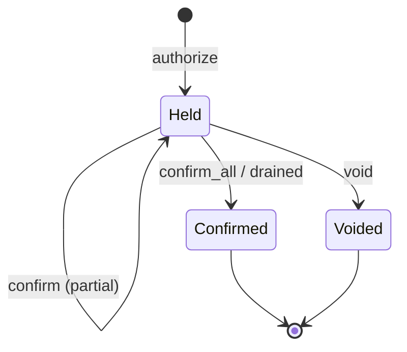

# Inflight holds

Inflight holds let you reserve funds now and settle later: authorize a trade,
then confirm it (in full or in parts) or void it. This is the
authorization/capture pattern, applied to a multi-leg trade.

The design and its rationale are in
[adr/0014-inflight-holds-via-holding-accounts.md](adr/0014-inflight-holds-via-holding-accounts.md).
This page is the usage guide.

## Model

An inflight transaction is an ordinary trade whose every destination is
rewritten to a fresh per-destination **holding account** (forbids overdraft via
the `DEBIT_MUST_NOT_EXCEED_CREDIT` flag, and flagged `INFLIGHT`). Committing that
rewritten transfer parks the funds:

```text
Confirmed trade            Inflight form
-----------------          --------------------------------
A -> B   -> 100 EUR        A -> hold(B)   -> 100 EUR
B -> A   ->  10 BTC        B -> hold(A)   ->  10 BTC
A -> fee ->   1 BTC        A -> hold(fee) ->   1 BTC
B -> fee ->   1 EUR        B -> hold(fee) ->   1 EUR
```

A hold is keyed by destination, so `hold(fee)` collects EUR from B and BTC from
A. Each holding posting's funder is recorded in the authorize transfer's leg
table, so a void returns each posting to the account that paid it.

Nothing new is stored. The authorize transfer is the record: its `EnvelopeId` is
the inflight handle, and its metadata carries the leg table. Every artifact
(holding accounts, authorize, confirm, void) is tagged with a CBOR-encoded
payload under a single `inflight` metadata key, so the lifecycle is read from
recorded fields, not inferred.

## Lifecycle



Every operation is an ordinary `commit`, so idempotency, conservation, and crash
recovery are inherited unchanged. A hold closes automatically once drained.

## API

All methods hang off `Ledger`.

```rust
use kuatia::prelude::*;

// Authorize the trade. Funds leave A and B and park in the holds.
let trade = TransferBuilder::new()
    .pay(a, b, eur, Cent::from(100))
    .pay(b, a, btc, Cent::from(10))
    .pay(a, fee, btc, Cent::from(1))
    .pay(b, fee, eur, Cent::from(1))
    .build();
let auth = ledger.authorize(trade).await?;

// Confirm one or more legs, built with the same .pay() interface as a transfer
// (from = funder, to = destination). Deliver 40 EUR of B's hold to B now:
let some = TransferBuilder::new()
    .pay(a, b, eur, Cent::from(40))
    .build();
ledger.confirm(&auth.inflight, some).await?;

// Confirm everything else and close the holds.
ledger.confirm_all(&auth.inflight).await?;

// ...or return everything to the funders instead.
ledger.void(&auth.inflight).await?;

// Derived status: per-leg authorized / confirmed / voided / held, plus state.
let status = ledger.inflight_status(&auth.inflight).await?;

// The holding accounts of every open inflight.
let open = ledger.list_open_inflights().await?;
```

`authorize` returns an `Authorization { inflight, receipt, legs }`. The
`inflight` field (an `EnvelopeId`) is the handle passed to every other call.

## Guarantees

- **Over-confirmation is impossible.** A hold forbids overdraft (the
  `DEBIT_MUST_NOT_EXCEED_CREDIT` flag is set), so confirming more than it holds
  fails validation. The sum of confirmations can never exceed the authorized
  amount.
- **No double-spend under concurrency.** Concurrent confirmations serialize on
  the shared holding posting via the reservation protocol. On contention, one
  wins and the caller retries the other against the new remaining balance.
- **State is derived.** The amount still held on a leg is `balance(hold, asset)`.
  Confirmed and voided amounts are summed from the metadata-tagged settling
  transfers. Nothing mutable is stored.

## Subaccounts and concurrency

A hold is a **subaccount** of its destination: `(destination, sub)`, where `sub`
is derived from a hash of the submitted trade (see
[adr/0012-subaccounts.md](adr/0012-subaccounts.md)). All holds
of one inflight share that `sub`. Because a different trade derives a different
`sub`, a destination can host **many concurrent inflights** at once, each isolated
in its own subaccount and listed by `ledger.list_subaccounts(&destination)`.
Re-authorizing the *identical* trade collides on the existing hold and is
rejected. Balances are always segregated per subaccount: `ledger.balances(&base,
&asset, None)` lists the main account and every open hold separately, never
summed.

## Constraints and limitations

- **Distinct movements.** Every movement in an authorize must move between two
  different accounts.
- **Void needs an open payer.** Voiding returns funds to the original funder, so
  that account must still be open.
- **Single funder per `(hold, asset)`.** When two accounts fund the same asset
  into the same destination hold, a partially-confirmed remainder cannot be
  split back to each funder exactly; void returns it in leg order.
- **Books.** A hold is created in the authorize transfer's book. If that book
  restricts participation by flag or account, it must admit the holds (for
  example by allowing the `INFLIGHT` flag).

## Where it lives

- `crates/kuatia/src/inflight.rs` — the API and metadata schema.
- `crates/kuatia/tests/inflight.rs` — authorize, confirm, partial confirm, void,
  over-confirm rejection, concurrent inflights per account, segregated balances,
  and status tests.
- `AccountFlags::INFLIGHT` — `crates/kuatia-types/src/lib.rs`.
