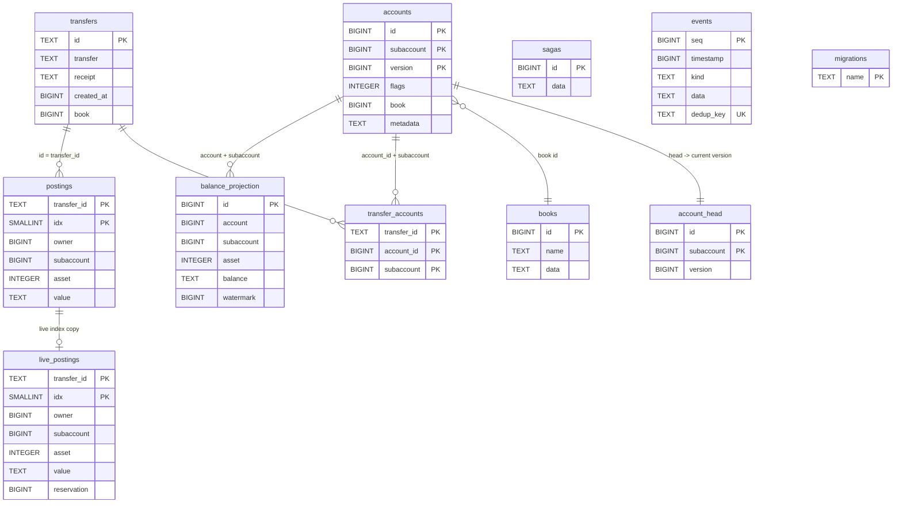

# SQL storage schema

Reference for the tables `kuatia-storage-sql` creates. This is the composed
end-state after replaying every migration in
`crates/kuatia-storage-sql/src/migrations/` (`001_init` through
`007_balance_projection`) plus the `_migrations` bookkeeping table created in
`crates/kuatia-storage-sql/src/migrate.rs`. It is a living reference: update it
when a migration lands. For *why* the schema looks this way, see the ADRs it
links to, not this file.

Ground rules that keep the catalog terse:

- **The store is a dumb record-keeper, so no foreign keys are declared.** Every
  cross-table relationship below is logical, enforced in Rust, not by the
  database. A posting's identity is `transfer_id + idx`; `account_head` points at
  the current `accounts` version; the account/transfer link is an explicit index
  table. See [ADR-0003](adr/0003-dumb-storage-saga-recovery.md).
- **Every payload, money, and hash column is `TEXT`.** Content-addressed ids and
  opaque saga bytes are lower-case hex; JSON payloads are their `TEXT`
  serialization; a `Cent` is its decimal string. The store never does arithmetic
  or `SUM`/`MAX` on these; balances are computed in Rust.
- **All ids are Rust-minted `BIGINT`.** No `AUTOINCREMENT` / `SERIAL`; snowflake
  ids come from `AutoId`. See [ADR-0015](adr/0015-fixed-width-account-code.md).
- The identical DDL runs on both SQLite and PostgreSQL (`sqlx::Any`).

Design rationale lives in [ADR-0016 (immutable postings + index
tables)](adr/0016-immutable-postings-index-tables.md), [ADR-0017 (append-only
hot indexes)](adr/0017-correctness-first-append-only-hot-indexes.md),
[ADR-0022 (merged live-postings hot index)](adr/0022-merged-live-postings-hot-index.md),
[ADR-0019 (cached balance projection)](adr/0019-cached-balance-projection.md),
and [ADR-0008 (conformance-tested storage)](adr/0008-conformance-tested-storage.md).

## Entity relationships

Edges are **logical only** (no `FOREIGN KEY` constraint exists); the labels name
how the ledger relates the rows in Rust.

(The `_migrations` table is shown as `migrations`; Mermaid entity names cannot
start with an underscore.)

## Accounts

Append-only, versioned accounts with a head pointer. Owned by `account.rs`
(`AccountStore`). See [ADR-0012 (subaccounts)](adr/0012-subaccounts.md) and
[ADR-0020 (account transition recovery)](adr/0020-account-transition-recovery.md).

### `accounts`

Every account version is an immutable row; a new version is appended, never
updated in place. `metadata` is JSON.

| Column | Type | Key | Purpose |
|---|---|---|---|
| `id` | `BIGINT` | PK | Base account id. |
| `subaccount` | `BIGINT` | PK | Subaccount code (`0` = base). |
| `version` | `BIGINT` | PK | Monotonic version; the chain is gap-free. |
| `flags` | `INTEGER` | | `AccountFlags` bitfield (frozen/closed/inflight, `DEBIT_MUST_NOT_EXCEED_CREDIT`). |
| `book` | `BIGINT` | | Owning book id. |
| `metadata` | `TEXT` | | JSON key/value metadata. |

- **Primary key**: `(id, subaccount, version)`.

### `account_head`

One row per account pointing at its current version, so a lookup is a single
indexed join instead of scanning the version chain. Maintained by delete+insert,
never `UPDATE`.

| Column | Type | Key | Purpose |
|---|---|---|---|
| `id` | `BIGINT` | PK | Base account id. |
| `subaccount` | `BIGINT` | PK | Subaccount code. |
| `version` | `BIGINT` | | The current version in `accounts`. |

- **Primary key**: `(id, subaccount)`.

## Postings

A posting is a signed amount of one asset owned by one (sub)account, identified
by `(transfer_id, idx)`. The immutable `postings` record is the historical source
of truth; one `live_postings` hot table carries a full row copy of the live set
(spendable + reserved), so spendable reads never merge back to history. Lifecycle
state is *derived* from `live_postings` membership plus its `reservation` column:
present with `reservation` NULL = Active, present with a reservation = Reserved,
in `postings` only = Spent, absent = Missing. Owned by `posting.rs`
(`PostingStore`). See
[ADR-0016 (immutable postings + index tables)](adr/0016-immutable-postings-index-tables.md),
[ADR-0017 (full-row hot copies)](adr/0017-correctness-first-append-only-hot-indexes.md),
[ADR-0022 (merged hot index)](adr/0022-merged-live-postings-hot-index.md),
[ADR-0006 (reservation protocol)](adr/0006-reservation-protocol-posting-lifecycle.md).

**Why one hot table with full-row copies?** The index originally held only ids in
two tables ([ADR-0016](adr/0016-immutable-postings-index-tables.md));
[ADR-0017](adr/0017-correctness-first-append-only-hot-indexes.md) switched to
full-row copies, and [ADR-0022](adr/0022-merged-live-postings-hot-index.md) merged
the active and reserved tables into one `live_postings` (a nullable `reservation`
replaces the two-table split). The hot read is "what can this account spend in
this asset" (`get_postings_by_account`, `query_postings`, and the balance sum):
carrying the data columns lets `live_postings` hold `idx_live_owner(owner,
subaccount, asset)`, so a live read is one index scan on a small table with no
join back to history and no `UNION` (the index *is* the table). The duplication
is safe because the copied columns are immutable: `postings` rows never change and
reserve/release only flip the `reservation` column, so a copy can never drift from
its value row. And it is bounded and disposable: only the live set is duplicated
(spent postings live in `postings` alone), and `live_postings` is rebuildable from
`postings` plus the saga write-ahead records, so a corrupt hot table is a
drop-and-rebuild, not data loss.

### `postings`

The immutable record. A row here that is absent from `live_postings` is Spent.

| Column | Type | Key | Purpose |
|---|---|---|---|
| `transfer_id` | `TEXT` | PK | Creating transfer's id (hex). |
| `idx` | `SMALLINT` | PK | Position within that transfer. |
| `owner` | `BIGINT` | | Owning base account id. |
| `subaccount` | `BIGINT` | | Owning subaccount code. |
| `asset` | `INTEGER` | | Asset id. |
| `value` | `TEXT` | | Signed `Cent` as a decimal string. |

- **Primary key**: `(transfer_id, idx)`.
- **Index**: `idx_postings_owner (owner, subaccount, asset)`.

### `live_postings`

The live-set hot copy: the six data columns plus a nullable `reservation`. A
posting is here while it is spendable or reserved; `reservation IS NULL` = Active,
a set `reservation` = Reserved by that saga. Reserve/release flip the column
(`UPDATE`), consume deletes the row (→ Spent). Rebuildable from `postings` + the
saga records.

| Column | Type | Key | Purpose |
|---|---|---|---|
| `transfer_id` | `TEXT` | PK | Posting id (hex). |
| `idx` | `SMALLINT` | PK | Position within the transfer. |
| `owner` | `BIGINT` | | Owning base account id. |
| `subaccount` | `BIGINT` | | Owning subaccount code. |
| `asset` | `INTEGER` | | Asset id. |
| `value` | `TEXT` | | Signed `Cent` as a decimal string. |
| `reservation` | `BIGINT` | | Nullable: NULL = Active, set = the `ReservationId` holding this posting (Reserved). |

- **Primary key**: `(transfer_id, idx)`.
- **Index**: `idx_live_owner (owner, subaccount, asset)`.

## Transfers

Committed envelope records and the account index that finds them. Owned by
`transfer.rs` (`TransferStore`).

### `transfers`

| Column | Type | Key | Purpose |
|---|---|---|---|
| `id` | `TEXT` | PK | Content-addressed envelope id (hex). |
| `transfer` | `TEXT` | | The `Envelope` as JSON. |
| `receipt` | `TEXT` | | The `Receipt` as JSON. |
| `created_at` | `BIGINT` | | Unix millis when stored (default `0`). |
| `book` | `BIGINT` | | Owning book id (default `0`). |

- **Primary key**: `id`.
- **Indexes**: `idx_transfers_created_at (created_at)`, `idx_transfers_book (book)`.

### `transfer_accounts`

The account -> transfer index; the caller supplies the involved set, the store
does no computation.

| Column | Type | Key | Purpose |
|---|---|---|---|
| `transfer_id` | `TEXT` | PK | The transfer id (hex). |
| `account_id` | `BIGINT` | PK | An involved base account id. |
| `subaccount` | `BIGINT` | PK | The involved subaccount code. |

- **Primary key**: `(transfer_id, account_id, subaccount)`.
- **Index**: `idx_xfer_acct (account_id, subaccount)`.

## Ledger plumbing

### `sagas`

Write-ahead saga records for crash recovery. Owned by `saga.rs` (`SagaStore`).
See [ADR-0002 (saga commit pipeline)](adr/0002-saga-commit-pipeline.md).

| Column | Type | Key | Purpose |
|---|---|---|---|
| `id` | `BIGINT` | PK | Saga id (the reservation id). |
| `data` | `TEXT` | | The encoded `PendingSaga` record (hex). |

- **Primary key**: `id`.

### `events`

The append-only ledger event log, idempotent on the dedup key. Owned by
`event.rs` (`EventStore`). See [ADR-0010 (event stream vs transfer
log)](adr/0010-event-stream-vs-transfer-log.md).

| Column | Type | Key | Purpose |
|---|---|---|---|
| `seq` | `BIGINT` | PK | Monotonic sequence number. |
| `timestamp` | `BIGINT` | | Unix millis of the event. |
| `kind` | `TEXT` | | Event kind tag (JSON). |
| `data` | `TEXT` | | The full `LedgerEvent` as JSON. |
| `dedup_key` | `TEXT` | UNIQUE | Stable key; a replayed event returns the existing `seq`. |

- **Primary key**: `seq`. **Unique**: `dedup_key`.

### `books`

Book definitions (asset/account/flag policy) as JSON. Owned by `book.rs`
(`BookStore`). See [ADR-0013 (journaling model)](adr/0013-journaling-model.md).

| Column | Type | Key | Purpose |
|---|---|---|---|
| `id` | `BIGINT` | PK | Book id. |
| `name` | `TEXT` | | Human-readable name. |
| `data` | `TEXT` | | The `Book` (with its `BookPolicy`) as JSON. |

- **Primary key**: `id`.

### `balance_projection`

Append-only balance cache points: each row snapshots one `(account, subaccount,
asset)` balance at a commit-time watermark. Rows are only inserted; a read picks
the highest-id row at or before a watermark. A derived, rebuildable accelerator,
never authoritative. Owned by `projection.rs` (`BalanceProjectionStore`). See
[ADR-0019](adr/0019-cached-balance-projection.md).

| Column | Type | Key | Purpose |
|---|---|---|---|
| `id` | `BIGINT` | PK | Rust-minted monotonic id (tie-breaker for equal watermarks). |
| `account` | `BIGINT` | | Base account id. |
| `subaccount` | `BIGINT` | | Subaccount code. |
| `asset` | `INTEGER` | | Asset id. |
| `balance` | `TEXT` | | The cached `Cent` as a decimal string. |
| `watermark` | `BIGINT` | | Commit-time watermark (unix millis) this snapshot covers. |

- **Primary key**: `id`.
- **Index**: `idx_balance_projection_closest (account, subaccount, asset, watermark, id)`.

### `_migrations`

The applied-migration ledger. Created in `migrate.rs` (not a `.sql` file); a
migration whose `name` is present is skipped, making `migrate()` idempotent.

| Column | Type | Key | Purpose |
|---|---|---|---|
| `name` | `TEXT` | PK | The migration name (e.g. `007_balance_projection`). |

- **Primary key**: `name`.
